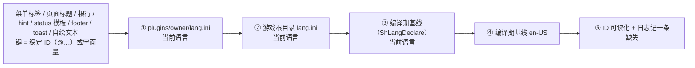

# 多语言（本地化）框架重构设计

> 状态：**设计稿 + 实施记录**（2026-09-14）。§1–§8 是原案；**§9 逐条记录已落地的部分、
> 与设计稿的有意偏差、以及待办**。附录 A/B 的行号是**改造前**的审计状态，仅作对照。
> 前置前提：项目**尚未发布公测版**，据此**假定没有历史兼容包袱** —— 允许一次性重写规则、重排文件、迁移现有 ini。
> 一句话目标：把"给人看的文本"收敛成**单一来源模型**（稳定 ID + 编译期基线 + 可选磁盘覆盖层），**删除"作用域 = 菜单标题路径"的整套机制**，并让语言**热切换**生效。

---

## 0. 结论摘要

### 0.1 目标形态



### 0.2 硬结论（本文档的设计契约）

| # | 结论 | 依据 / 说明 |
|---|---|---|
| C1 | **文本键 = 稳定 ID**，以 `@` 前缀机械判定；不以 `@` 开头的字符串按**字面量**当键 | 字面量通路保留给**无法改代码的黑盒插件**（见 §1.9）；不是兼容层而是唯一可行手段 |
| C2 | 每条文本有**四层来源**：插件 `lang.ini` → 框架 `lang.ini` → 编译期基线（当前语言）→ 编译期基线 `en-US` | §2.2；磁盘层是**覆盖层**且支持**部分覆盖** |
| C3 | **删除作用域机制**：`MenuPath`、点分作用域退化走链、`IsLangSection` 的语言前缀过滤、从插件自身 ini 读语言段的支路全部移除 | ID 自身编码了页面路径，不再需要靠菜单标题消歧（见 §1.3、§1.6、§2.8） |
| C4 | 语言代码采用 **BCP-47**（`zh-CN`、`en-US`）；因无兼容包袱，**一次性迁移，不做 `zh_cn` 别名** | §2.6 |
| C5 | 每个 owner 一份 `lang.ini`：插件 `plugins\<owner>\lang.ini`，框架 `<gamedir>\lang.ini` | §4.1；框架 = "owner 为空的插件"，两侧对称 |
| C6 | **`*.ini` 可写、`lang.ini` 只读**（程序永不回写语言文件） | §4.2；沿用项目既有认识（`build_msvc.ps1:316-320`） |
| C7 | 编译期基线用 `ShLangDeclare(owner, lang, rows, n)` **每语言一次调用**；默认内置 `zh-CN` + `en-US` | §2.4；加语言 = 加一张表 + 一行注册 |
| C8 | **删掉任何 `lang.ini`，中英仍可切**（基线兜底）；缺行的 ID 逐行回落 | §4.4 |
| C9 | 默认语言清单**从基线推导**（`[Settings] Languages` 缺省 = 基线语言集合） | §2.6；以后"默认集成更多语言"= 基线里多一张表 |
| C10 | **热切换**：解析器收集清单内全部语言，内存只留当前语言，切换 = 清表 + 重扫 | §5；菜单文本每帧从模型翻译，无需重建菜单 |
| C11 | 文本**全出口统一**：标题/根行、hint、status 模板、footer 格式、toast、自绘窗口 | §3 |
| C12 | `[MenuHints]` 段**取消**（并进文本键 `<页面键>.hint`）；`[MenuOrder]` 的键改为**页面键** | §3.2、§3.8 |
| C13 | 容量与截断**不再静默**：上限提高、超限记日志、诊断页可查 | §6-P0 |
| C14 | 状态行模板支持**占位符重排**（`%1$s`，**框架自实现**，方案 B），译文中的字面 `\n` 解析为换行 | §3.3 |

### 0.3 待拍板 / 待实测

| 项 | 状态 | 处理 |
|---|---|---|
| 本期把 **20 个插件源码**全部改成 ID | **已定：是**（一轮做完，按 §7.4 顺序推进） | 字面量通路仍保留，供 6 个黑盒插件使用 |
| `ShToast*` / `ShDraw*` 纳入本期统一出口 | **已定：纳入** | 签名不变，只加一层解析（§3.5、§3.6） |
| 黑名单状态行改用插件**显示名** | **已定：改用** | 显示名取自插件页面键，回落目录名（§3.9、§6-P1） |
| `lang.ini` 带 UTF-8 BOM 是否使整表失效 | **静态推导已明确**，待实测复核 | §8.4；实测判据见该节，**不当作已证结论** |
| 现有 ini 是否已有 BOM | **已实测：无** | 23 份插件 ini + `scripthook.ini` 首字节均非 `EF BB BF`（§1.9） |
| 位置参数（`%1$s`）的实现路径 | **已定：方案 B —— 框架自实现 + 加载期校验，不用 `_vsprintf_p`**（MSVC 链实测 `_vsprintf_p` 可用，但只覆盖一条链、且无法校验译文） | §3.3、§8.5 第 1 条（含实测记录） |

---

## 1. 现状审计

### 1.1 API 面

`scripthook.h` 的 `@defgroup lang`（`scripthook.h:2710-2737`）：

| 函数 | 声明 | 实现 |
|---|---|---|
| `ShLang(const char *text)` | `scripthook.h:2725` | `scripthook_config.c:782-793` |
| `ShLangFor(const char *scope, const char *text)` | `scripthook.h:2728` | `scripthook_config.c:805-807`（转 `ShLangForOwned(NULL,…)`） |
| `ShLangForOwned(owner, scope, text)` | `scripthook.h:2733-2735` | `scripthook_config.c:1006-1019` |
| `ShLangGet(void)` | `scripthook.h:2737` | `scripthook_config.c:1021-1024` |

**全部调用点**（仓库内）：

| 位置 | 用途 |
|---|---|
| `scripthook_menu.c:349,350,361` | `ValueText`：`[开]/[关]`、列表选中项 |
| `scripthook_menu.c:924,925` | 根菜单两条框架按键提示（`ShLang`） |
| `scripthook_menu.c:929,936,940,942,960` | 捕获路径：hint / title / status / 行标签 |
| `scripthook_menu.c:1316` | `ShMenuStatusF` 的模板翻译 |
| `scripthook_modsettings.c:344` | `ShLangGet()`（语言行当前值） |
| `scripthook_modsettings.c:374,375,440,441,498,518,530,533,536,545,550` | 设置页各行的字面量文本 |
| `scripthook_blacklist.c:258,414` | 黑名单状态行 |
| `GhostNoWipe.c:1139` | 唯一在插件里晚绑定取 `ShLangForOwned` 的地方 |

### 1.2 数据来源与查找链

```782:793:scripthook_config.c
/** Translate without a scope: the [lang] table, then English. */
SH_API const char *ShLang(const char *text) {
    const char *v;

    if (!text) return "";
    LoadConfig();
    if (g_langName[0]) {
        v = LangFind(g_langName, "", text);
        if (v) return v;
    }
    v = LangFind("en", "", text);
    return v ? v : text;
}
```

`TableChainFind`（`scripthook_config.c:954-1001`）把作用域逐级用 `strrchr('.')` 截短（`A.B.C → A.B → A`），每级先查主表后查插件表；`ShLangForOwned`（`:1006-1019`）对"当前语言"和 `en` 各走一遍这条链。声明处的契约注释也写明了这一点（`scripthook.h:2712-2722`）。

**结论**：现有链是 `plugin(lang) → main(lang) → plugin(en) → main(en) → 原文`，且**语言与作用域两条退化轴耦合在一起**（两层循环 × 逐级截短）。

### 1.3 语言段识别：语义反转点

```669:675:scripthook_config.c
static int IsLangSection(const char *sec) {
    size_t n;
    if (!sec || !sec[0] || !g_langName[0]) return 0;
    n = strlen(g_langName);
    if (strncmp(sec, g_langName, n)) return 0;
    return sec[n] == 0 || sec[n] == '.';
}
```

它**只认当前语言前缀**。四个引用点：`scripthook_config.c:529`、`:582`（`ParseIniLine` 的键值切分规则）、`:621`（`ParseConfig` 路由）、`:886`（`ParsePluginLangs`）。

后果：
1. **非当前语言的段根本不进表** —— 切语言必须重新解析，也回答不了"这份 ini 有哪几种语言"；
2. `[Settings] Languages` 里列了某语言、但表里没有，切过去就是"全英文"，**没有任何提示**；
3. `IsLangSection` 是"是不是语言段"的**唯一判据**，一旦改为"是不是清单里的语言"，全文解析路径都要跟着动（见 §5）。

配套：`PeekLanguage`（`:679-720`）先扫一遍 `[Settings] Language=`，`ResolveLanguage`（`:774-779`）缺省填 `zh_cn`，由 `LoadConfig`（`:1044`，调用点 `:1075`）串起来。

### 1.4 容量、长度与静默丢弃

| 常量 / 字段 | 定义 | 后果 |
|---|---|---|
| `CONFIG_MAX 65536u` | `scripthook_config.c:141` | **整份 ini 读入上限**（主表 `:150`、插件表 `:897`、写回 `:1304`） |
| `ENTRIES_MAX 256` | `:142` | 主配置条目上限（与翻译表分开，翻译不进这张表） |
| `LANGS_MAX 512` | `:656` | 主表译文条数上限（`g_langs` `:665`） |
| `PLANGS_MAX 512` | `:815` | **所有插件合计**的译文条数上限（`g_plangs` `:826`） |
| `PLOAD_MAX 32` | `:816` | 最多记住 32 个 owner |
| `LangEntry{lang[16],scope[48],key[128],value[256]}` | `:658-663` | 条目 ≈ 448 B；`value[256]` 截断长状态行模板 |
| `PlangEntry{owner[48],lang[16],scope[48],key[128],value[256]}` | `:818-824` | 条目 ≈ 496 B |

**超限是静默的**：

```722:729:scripthook_config.c
static void AddLangEntry(const char *section, const char *key,
                         const char *value) {
    char lang[16], scope[48];
    const char *dot;
    size_t n;
    LangEntry *e;

    if (g_nlangs >= LANGS_MAX) return;
```

`AddPlangEntry`（`:845`）同样直接 `return`。渲染侧还有**第二组截断点**（与解析侧不同）：`ShMenuRow.name[96]`、`ShMenuRow.value[32]`、`ShMenuView.title[48]`/`hint[128]`/`status[96]`/`footer[16]`（`scripthook.h:1073-1090`），以及 `Item.label[LABEL]`、`Menu.title[LABEL]` 的 `LABEL 48`（`scripthook_menu.c:30`、`:50`、`:62`）。

### 1.5 懒加载与锁

`PluginLangsLoad`（`scripthook_config.c:895-934`）**每 owner 只加载一次**（含"文件不存在"也记为已加载）：

```914:924:scripthook_config.c
    if (slot >= 0 && g_pload[slot].done) {
        LeaveCriticalSection(&g_plangLock);
        return;
    }
    if (slot < 0 && g_npload < PLOAD_MAX) {
        slot = g_npload++;
        strncpy(g_pload[slot].owner, owner,
                sizeof(g_pload[slot].owner) - 1);
        g_pload[slot].owner[sizeof(g_pload[slot].owner) - 1] = 0;
    }
    if (slot >= 0) g_pload[slot].done = 1;
```

后果：**改插件 ini 的译文必须重启游戏**（该行为已被记录在 `docs/npcspawner-reverse.md:177-178`）；且 `PLOAD_MAX 32` 之外（或第 32 个之后）的 owner 连表都不会建。

锁有两把：`g_plangLock`（`:835-836`，按需初始化，`PluginLangsLoad` 内持锁）、`g_cfgLock`/`g_cfgLockReady`（`:1026-1035`，parse-once 与读回共用）。`ShConfigSetStr`（`:1473`）走 `IniWriteValue`（`:1267`）**整份重写** ini 并刷新内存副本。

### 1.6 菜单侧：作用域来自"标题路径"

```764:775:scripthook_menu.c
/* Dotted title path from the first submenu under the root down to
 * m, e.g. "First person.Custom". Empty for the root itself. Used as
 * the translation scope, so a deeper menu first matches its own
 * section and falls back up its ancestors: [zh_cn.A.B.C] ->
 * [zh_cn.A.B] -> [zh_cn.A] -> [zh_cn]. */
static void MenuPath(const Menu *m, char *out, int n) {
    const char *titles[8];
    int k = 0;
    size_t used = 0;
    const Menu *cur = m;
```

调用点：`scripthook_menu.c:913`、`:914`（`parentPath`）、`:1315`（`ShMenuStatusF`）。

`ShMenuCaptureView`（`scripthook_menu.c:881-974`）取词分布：

| 文本 | 行号 | 取词方式 |
|---|---|---|
| 根菜单按键提示 | `:922-926` | `ShLang("F4 toggle menu, Enter select, ESC back")` 等两条硬编码 |
| 子页 hint | `:927-929` | `ShLangForOwned(owner, path, m->hint)` |
| `[MenuHints]` 兜底 | `:930-936` | `ShConfigGetStr("MenuHints", m->title, …)`，**键是菜单标题** |
| 标题 | `:939-940` | `ShLangForOwned(owner, parentPath, m->title)`（**父路径**） |
| 状态行 | `:941-942` | `ShLangForOwned(owner, path, m->status)` |
| 行标签 | `:943-965` | `ShLangForOwned(rowOwner, path, it->label)`；子菜单行用**子菜单的 owner**（`:955-957`） |
| footer | `:966-971` | 框架生成，硬编码 `"%d / %d"` |

根行与页面标题**同源**：`ShMenuCreate` 既是页面标题也是根菜单那一行（`scripthook_menu.c:1088-1092`），owner 由 `OwnerFromAddress`（`:132-157`）从调用地址反查插件目录名。

`ShMenuStatusF`（`:1303-1323`）先翻模板再 `vsnprintf`：

```1313:1320:scripthook_menu.c
    m = MenuOf(menu);
    if (!m) { Unlock(); ShSetError(SH_ERR_BAD_ARG); return 0; }
    MenuPath(m, path, sizeof(path));
    SafeCopy(tmpl, sizeof(tmpl), ShLangForOwned(m->owner, path, fmt));
    Unlock();

    va_start(ap, fmt);
    vsnprintf(text, sizeof(text), tmpl, ap);
```

**它把翻译后的成品写进模型**，这正是热切换必须处理的地方（§5.4）。

### 1.7 其它文本出口（现状：无翻译）

| 出口 | 位置 | 现状 |
|---|---|---|
| footer（页码） | `scripthook_menu.c:966-971` | 框架硬编码 `"%d / %d"`，无翻译出口 |
| Toast | `scripthook.h:1396-1418`（`ShToast`/`ShToastEx`/`ShToastSet`） | 直接显示传入文本 |
| 自绘窗口 | `scripthook.h:1252-1258`（`ShDrawText`/`ShDrawTextColored`/`ShDrawTextWrapped`/`ShDrawHint`）、`:1273`（`ShDrawButton`） | 直接显示传入文本 |
| 黑名单状态行 | `scripthook_blacklist.c:258,414` | 框架文本走 `ShLang`，但**插件名是目录名** |

### 1.8 配置与文案同居的实证

`DEFAULT_CONFIG`（`scripthook_config.c:157-465`）是首启生成的默认 `scripthook.ini`，其中**译文段跨 `:309-465`，共 157 行**：

| 段 | 行号范围 |
|---|---|
| `[zh_cn]` | `:309-362` |
| `[zh_cn.Chaos]` | `:364-371` |
| `[zh_cn.Field of view]` | `:373-379` |
| `[zh_cn.First person]` | `:381-388` |
| `[zh_cn.Free camera]` | `:390-393` |
| `[zh_cn.Vehicles]` | `:395-465` |

也就是说：**同一批译文在代码里又抄了一份**，加一条框架文案要改两处；并且这份 ini 是"删掉即重置"的文件（`docs/plugins.md:31-36`），重置会**连译文一起丢**。

### 1.9 现有资产盘点（实测）

| 项 | 数量 | 明细 |
|---|---|---|
| 游戏目录插件数 | 23 | `plugins\` 下每个一个文件夹 |
| 自带 `[zh_cn]` 段的插件 ini | **16** | 无语言段的 5 个：`cnchat`、`draw_sample`、`GhostWipeProbe`、`LastRites_dlcfix`、`ModeCallProbe` |
| 插件 ini 带 UTF-8 BOM | **0** | 23/23 首字节非 `EF BB BF`；`scripthook.ini` 首字节为 `3B 20 47`（`"; G"`） |
| 仓库参考 `scripthook.ini` 的语言段 | **17** | 见下 |
| 游戏目录 `scripthook.ini` 的语言段 | **7** | `[zh_cn]`(:220)、`[zh_cn.ScriptHook settings.Plugin switches]`(:297)、`[zh_cn.Bullet Drop]`(:313)、`[zh_cn.Bullet Velocity]`(:318)、`[zh_cn.Reinforcement]`(:323)、`[zh_cn.First person]`(:337)、`[zh_cn.Forge Mod Loader]`(:424) |
| 无源码插件（不可重编译） | **6** | `AmmoCapacity`(15.5 KB)、`DayNightVisibility`(17.5 KB)、`EqualizeEnemyHealth`(13.5 KB)、`GunShotDetection`(16.5 KB)、`Time&Weather`(17 KB)、`gadget_probe`(150.5 KB)；前五个都有 `[zh_cn]` 段（即都有菜单） |
| 调用菜单 API 的插件源码 | **20** | 16 个晚绑定（`GetProcAddress`/`Bind` 取 `"ShMenu…"` 符号）+ 4 个静态链接直调（`cnchat.c`、`chaos.c`、`fov_changer.c`、`OpticalCamo.c`） |
| 框架内部菜单使用者 | 2 | `scripthook_modsettings.c`、`scripthook_forge.c` |

晚绑定插件文件的符号清单（每个文件自带 typedef，这是晚绑定的证据）示例：

```108:115:firstperson.c
typedef uint32_t (*MenuSub_t)(uint32_t, const char *);
typedef int (*MenuToggle_t)(uint32_t, const char *, int,
                            ShMenuFn, void *);
typedef int (*MenuNumber_t)(uint32_t, const char *, float, float,
                            float, float, ShMenuFn, void *);
typedef int (*MenuList_t)(uint32_t, const char *, const char **,
                          int, int, ShMenuFn, void *);
typedef int (*MenuSetValue_t)(uint32_t, const char *, int);
typedef int (*MenuStatus_t)(uint32_t, const char *);
```

**它的设计含义（重要）**：改菜单函数签名**不是改头文件那么简单** —— 20 个插件里 16 个按符号名晚绑定、自带 typedef，改签名会让它们"编译通过、取值非空、参数错位"，进菜单即崩。所以本设计**不改任何菜单函数签名**（见 §2.4、§7.4）。

### 1.10 硬伤清单

| 编号 | 硬伤 | 证据 |
|---|---|---|
| H1 | 键与作用域都是**会变的英文显示文本**，改名即静默失效 | §1.2、§1.6；上一轮页面改名（`Plugins` → `Plugin switches`）就搬过一次 `[zh_cn.ScriptHook settings.Plugin switches]` |
| H2 | 只收集当前语言的段，切语言必须重启，无法自检语言覆盖 | `:669-675` |
| H3 | 超限静默丢弃、无日志 | `:729`、`:845` |
| H4 | 长度上限偏小，译文会被截断（两处不同的截断点） | `:658-663`、`scripthook.h:1073-1090` |
| H5 | 插件 ini 译文只加载一次，改译文需重启；owner 上限 32 | `:914-924`、`:816` |
| H6 | 无缺译诊断：23 个插件的缺译情况不可见 | 无对应实现 |
| H7 | 译文与配置同居：删 ini 重置会丢译文；生成器重复维护一份译文 | §1.8、`docs/plugins.md:31-36` |
| H8 | 状态行模板不支持位置参数，中文语序无法调整；多行只能靠代码拼 `\n` | `:1313-1320`、`:922-926` |
| H9 | Toast / 自绘 / footer 无翻译出口 | §1.7 |
| H10 | `[MenuHints]`、`[MenuOrder]` 也拿标题当键，同类失效风险 | `scripthook_menu.c:932`、`:844-860`、`scripthook_modsettings.c:466-467` |

---

## 2. 目标设计

### 2.1 文本模型三要素

| 要素 | 规则 |
|---|---|
| **键（key）** | 以 `@` 开头 = 稳定 ID；否则 = 字面量（该字符串自身即键）。判定只此一条，无第二种解释 |
| **语言（lang）** | BCP-47 字符串（`zh-CN`、`en-US`、`ja-JP`…）。系统不预设白名单，但**默认清单**由编译期基线决定（§2.6） |
| **来源（source）** | 磁盘覆盖层（`lang.ini`）→ 编译期基线 → ID 可读化 |

### 2.2 四层来源与判定顺序

```
① plugins\<owner>\lang.ini     [当前语言]      ← 覆盖层，可只写要改的行
② <gamedir>\lang.ini           [当前语言]      ← 覆盖层（框架与 owner 通吃的兜底）
③ 编译期基线（ShLangDeclare）   [当前语言]
④ 编译期基线                  [en-US]
⑤ 键以 @ 开头且全未命中：输出 ID 可读化文本（@camo.page.visibility → "Camo Page Visibility"）+ 记一条缺失日志
   键不以 @ 开头：原样输出（字面量即原文）
```

与现有的关键差别：
- **没有作用域退化轴**（不再有 `A.B.C → A.B → A`）；
- **没有 `en` 表参与磁盘层**（英文原文在基线里，`lang.ini` 里写 `[en-US]` 只是"不重编译改英文"的可选口子）；
- 磁盘层与基线层是**覆盖**关系，不是并列查找关系。

### 2.3 ID 命名规范

| 位置 | 规范 | 例 |
|---|---|---|
| 插件页面 | `@<short>.page` | `@fp.page`、`@camo.page` |
| 页面内行 | `@<short>.<item>` | `@camo.page.enabled`（页面前缀可省） |
| hint | `@<short>.page.hint` | `@fp.page.hint` |
| 状态行模板 | `@<short>.status.<name>` | `@camo.status.active` |
| Toast | `@<short>.toast.<name>` | `@fp.toast.saved` |
| 框架自带 | `@menu.*`、`@settings.*` | `@settings.page`、`@settings.plugins`、`@settings.cpu`、`@settings.language`、`@menu.root.hint`、`@menu.on`、`@menu.off`、`@menu.footer.pos` |

约束：`@` 后的字符集建议 `[a-z0-9._-]`；长度上限按 `key[128]` 校验（§6-P0 会把它提高到 192）。

框架自带页的**固定 ID**（显示标题与 ID 解耦，改名不动 ID）：

| 页面 | 固定 ID | 当前显示标题（英文基线） |
|---|---|---|
| 设置首页 | `@settings.page` | `ScriptHook settings` |
| 插件开关页 | `@settings.plugins` | `Plugin switches` |
| CPU 调度页 | `@settings.cpu` | `CPU scheduling` |
| 语言行 | `@settings.language` | `Menu language` |
| 总开关行 | `@settings.load` | `Load plugins (master switch)` |

### 2.4 `ShLangDeclare`（编译期基线）草案

```c
/** 一段文本：稳定 ID + 该语言下的文本 */
typedef struct ShText { const char *id; const char *text; } ShText;

/** 为一个 owner 声明一种语言的文本表。可多次调用：
 *  语言不同 = 多调一次；同一语言多张表 = 表与表叠加（后者覆盖前者）。
 *  owner NULL 或 "" = 框架自己。lang 为 BCP-47。
 *  rows 的内存必须常驻（静态 const 数组即可），框架只保存指针。 */
SH_API int ShLangDeclare(const char *owner, const char *lang,
                         const ShText *rows, int n);
```

用法（插件默认集成中英）：

```c
static const ShText kEn[] = {
    { "@fp.page",      "First person" },
    { "@fp.hidehead",  "Hide head" },
    { "@fp.page.hint", "W/S select, Enter confirm, Esc back" },
};
static const ShText kZh[] = {
    { "@fp.page",      "第一人称" },
    { "@fp.hidehead",  "隐藏头部" },
    { "@fp.page.hint", "W/S 选择，回车确认，Esc 返回" },
};
ShLangDeclare("firstperson", "en-US", kEn, 3);
ShLangDeclare("firstperson", "zh-CN", kZh, 3);
```

为什么是"**每语言一张表**"而不是 `{ id, en, zh }`：后者每加一种语言都要改结构体定义 + 每一行，插件全部重编；前者**加语言 = 加一张表 + 一行注册**，老代码零改动。这一点直接决定"以后想默认集成更多语言"的成本（§6-P2）。

框架自己用同一个 API（`owner` 传 `NULL`），表放在专门的新源文件里（建议 `scripthook_text.c`）：

```c
/* 主题：框架自己的文案，编译进 dll。新增语言 = 新增一张表 + 一行注册 */
static const ShText kFrameworkZh[] = {
    { "@settings.page",    "ScriptHook 设置" },
    { "@settings.plugins", "各插件开关" },
    { "@settings.cpu",     "CPU 调度" },
    { "@settings.language","菜单语言" },
    { "@menu.on",          "开" },
    { "@menu.off",         "关" },
    { "@menu.root.hint",   "F4 开关菜单，回车选择，ESC 返回\n↑ ↓ 或 W/S 选择，← → 或 A/D 调整" },
    { "@menu.footer.pos",  "第 %1$d / %2$d 行" },
    /* … */
};
```

工程要点：
- 表在 `.rodata`，**不解析、不拷贝**：查询时直接扫（可选：初始化时按 ID 排序做二分）。
- 源码已带 `/utf-8`（`build_msvc.ps1:102`、`:168`），且仓库里已有中文字面量先例（`firstperson.c:445`、`scripthook_config.c:310` 起），所以中文进 `.c` **不需要新开关**。
- 源码保持 **UTF-8 无 BOM**。

### 2.5 磁盘覆盖层格式（`lang.ini`）

```ini
; plugins\OpticalCamo\lang.ini   （UTF-8 无 BOM）
; 覆盖编译期基线：只写要改的行即可，未写的回落基线
[zh-CN]
"@camo.page"            = 光学迷彩加强
"@camo.page.enabled"    = 光学迷彩（蹲下生效）
"@camo.page.visibility" = 迷彩强度
"@camo.status.active"   = 激活 | %.3fx

[en-US]
"@camo.page"            = Optical Camo Plus     ; 覆盖基线英文（可选）

[LanguageNames]
zh-CN = 简体中文
en-US = English
```

规则：
1. **段名 = 语言代码**（BCP-47，大小写不敏感比较：`zh-cn` 与 `zh-CN` 同段）。
2. **键带引号可选**，沿用现有 `ParseIniLine` 的引号与 `" = "` 规则（`scripthook_config.c:522-601`）；带引号才能安全容纳 `=`、前导空白。
3. **部分覆盖**：未出现的 ID 走基线；磁盘层不需要与基线等长。
4. **同文件同键重复：先出现的胜**（与现有 `LangFind` 的首个命中语义一致，`scripthook_config.c:754-767`）；诊断页会提示重复键。
5. `[LanguageNames]` 是**唯一不受语言前缀管辖**的段（§4.3）。
6. 文件里的**非语言段**（`[Settings]` 等）不参与翻译——但 `lang.ini` 不应出现配置段，诊断时报警。

### 2.6 语言集合与默认值

| 键 | 缺省值来源 | 说明 |
|---|---|---|
| `[Settings] Languages` | **编译期基线里注册过的语言集合**（按注册顺序） | 取代现在写死的 `"zh_cn,en"`（`scripthook_modsettings.c:307`、`:335`、`scripthook_config.c:281`） |
| `[Settings] Language` | 基线集合的第一个语言 | 取代现在写死的 `zh_cn`（`scripthook_config.c:278`、`:776`） |
| 可选增强（P2） | `GetUserDefaultLocaleName` 命中基线集合则用它，否则 `en-US` | "跟随系统区域" |

于是"以后默认集成更多语言"= **基线里多一张表 + 一行注册**，选择器自动多一项；用户显式写了 `Languages` 就按他写的（允许只显示其中一部分）。

### 2.7 键的解析与冲突裁决

| 情形 | 裁决 |
|---|---|
| 同一 ID 在插件 `lang.ini` 与框架 `lang.ini` 都有 | **插件文件优先**（沿用现有"插件 ini 优先于总表"的约定，`scripthook.h:2718-2722`） |
| 同一 ID 在 `lang.ini` 与基线都有 | **文件优先**（这是"不改代码改文案"的通路） |
| 同一 ID 在同一文件里出现两次 | 先出现的胜 + 诊断页提示 |
| 键是字面量（黑盒插件） | 走同一条四层链；基线里通常没有，落在插件 `lang.ini` |
| 键是 ID 但四层都没有 | 输出 ID 可读化文本 + 日志记 `missing`（**不静默回退英文**） |

### 2.8 与现状的机制对照

| 现有机制 | 处置 | 备注 |
|---|---|---|
| `MenuPath`（标题路径当作用域） | **删除** | `scripthook_menu.c:769-775` 及 3 个调用点 |
| 作用域逐级退化走链 | **删除** | `TableChainFind:954-1001` |
| `IsLangSection` 的语言前缀过滤 | **删除**，改为"段名是清单里的语言" | `:669-675` |
| 从插件自身 ini 读 `[lang]` 段的支路 | **删除**（改读该插件的 `lang.ini`） | `:875-934` |
| `[MenuHints]` 段 | **删除**，改为 `<页面键>.hint` | `scripthook_menu.c:930-936` |
| `[MenuOrder]` 以标题为键 | **改键为页面键** | `:844-860`、`scripthook_modsettings.c:466-467` |
| `en` 表参与磁盘查找 | **取消**（英文在基线；`[en-US]` 仅作覆盖） | `:1017` |
| `ShLang`/`ShLangFor`/`ShLangForOwned` 三个入口 | **收敛为一个** `ShLangText(owner, key)`，旧名保留为薄包装 | `scripthook.h:2725-2735` |
| `done` 懒加载标记 | **删除**，改"按 (owner,lang) 缓存 + 可失效" | `:914-924` |

---

## 3. 文本的归属与作用域（全出口）

### 3.1 页面标题与根菜单行

**一个键供两处**：`ShMenuCreate` 既建页面标题也建根菜单那一行（`scripthook_menu.c:1088-1092`），所以：

```c
ShMenuCreate("@fp.page");       /* 根行 + 标题栏 */
```

取词用**该页面自己的 owner**（现在就是子菜单 owner 的规则，`:955-957`，保留），于是"根菜单上这一行归谁翻"= 它自己的 `lang.ini`。框架自带页 owner 为空 → `<gamedir>\lang.ini`。

### 3.2 hint（顶部提示）

| 场景 | 键 |
|---|---|
| 插件显式设置 | `ShMenuHint(page, "@fp.page.hint")` |
| 插件没设置（含黑盒插件） | 框架合成 `<页面键>.hint`：`"@fp.page.hint"`、`"Time & Weather.hint"` |
| 根菜单两条框架提示 | `@menu.root.hint`（一条文本，用字面 `\n` 分行） |

译文中的**字面 `\n` 解析为换行**（现在只能在代码里 `snprintf("%s\n%s", …)` 拼，`scripthook_menu.c:922-926`）。

### 3.3 status（动态状态行）

```c
ShMenuStatusF(page, "@camo.status.active", factor);   /* 签名不变 */
```

- 框架按 owner 取模板，再格式化一次。**模板不含 `%n$` 时直接走 `vsnprintf`（零开销，行为与今天完全一致）**；
- 含 `%n$` 时走**框架自实现的位置参数**（方案 B，**已定**）：两遍扫描模板 → 按索引取 `va_list` → 归一化后逐个格式化。**不依赖 `_vsprintf_p`**，两条构建链行为一致（实测见 §8.5 第 1 条）；
- **加载期校验译文模板**：转换说明的类型序列必须与英文基线模板一致（索引集合 + 类型）；裸 `%`、未知索引、类型冲突 → 记日志 + **回落英文模板**。这条把"译文写错一个 `%` 就静默错乱"变成日志里的一条记录；
- `scripthook.h:1030-1037` 的"模板与值须用同样的转换说明"契约放宽为"**类型须一致，顺序可重排**"；
- 同样支持字面 `\n` 换行（`ShMenuView.status[96]`，`scripthook.h:1084`）。

### 3.4 footer（页码）

格式串变成可翻译的框架键：

| 键 | `zh-CN` | `en-US` |
|---|---|---|
| `@menu.footer.pos` | `第 %1$d / %2$d 行` | `%d / %d` |

调用点 `scripthook_menu.c:966-971` 改为按该键取模板。

### 3.5 Toast

**不加新 API**：`ShToast`/`ShToastEx`/`ShToastSet`（`scripthook.h:1396-1418`）内部先过一次文本解析：

```c
ShToast("@fp.toast.saved");                    /* ID → 译文 */
ShToastEx("@fp.toast.scanning", 0xFFD700, 0);  /* 同上 */
```
- 传 ID → 走基线 + `lang.ini`；传普通文本 → 走字面量查表（黑盒插件可享受汉化）；
- 带参数的动态提示建议加 `ShToastF(id, fmt, ...)`（与 `ShMenuStatusF` 对称）；不做也能用，只是动态拼好的成品文本按字面量查表。

### 3.6 自绘 / HUD 文本

`ShDrawText`/`ShDrawTextColored`/`ShDrawTextWrapped`/`ShDrawHint`/`ShDrawButton`（`scripthook.h:1252-1258`、`:1273`）同样过一个解析函数。owner 由调用地址推断（复用 `OwnerFromAddress`，`scripthook_menu.c:132-157`），插件不必自己传 owner。

### 3.7 不进语言表的东西（边界）

| 不进 | 原因 / 替代 |
|---|---|
| 日志（`logs\*.log`） | 技术面，保持英文，便于检索与比对 |
| 键名（VK 显示） | 语言中立（`scripthook_menu.c:1230` 已注明） |
| ini 的**键**（`[plugins]` 目录名、`[MenuOrder]` 的页面键、`[Settings]` 各键） | 技术标识，不翻译 |
| 数字与单位符号 | **单位要写进模板**：`"%d m"` → 译文可写 `"%d 米"`；不要在代码里硬拼单位（`NPCSpawner` 的 `< 30 m >` 属于此类硬拼） |
| `[开]/[关]`、`< … >`、`>`、`< ... >` | 框架生成的 UI 词；`"on"`/`"off"` 已经是键（`scripthook_menu.c:343-372`），改为 `@menu.on`/`@menu.off` |

### 3.8 由文本键派生的 ini 键

| 表 | 键 | 变化 |
|---|---|---|
| `[MenuOrder]` | **页面键**（ID 或字面量标题） | 现在按 `label`（`:844-860`）→ 改按页面键；迁移见 §7.2 |
| `[MenuHints]` | — | **取消**，见 §3.2 |
| `[plugins]` | 插件目录名 | 不变（技术标识） |
| `[Settings] Language/Languages` | 语言代码 | 值改为 BCP-47（§2.6） |

### 3.9 框架状态行与开关页里的插件名

| 位置 | 现在 | 改为 |
|---|---|---|
| 黑名单状态行（`scripthook_blacklist.c:258,414`） | 列插件**目录名**（`firstperson, freecam`） | 列**显示名**；显示名缺失时回落目录名，必要时写成 `显示名 (目录名)` |
| `ScriptHook 设置 → 各插件开关` 页（`scripthook_modsettings.c:286-290`） | 行标签就是目录名（它同时是 `[plugins]` 的键） | 显示名优先、目录名仍是键：`训练器 (trainer)` |

显示名的取法：用该插件的**页面键**（`@<short>.page`，§3.1）在同一张表里查；没有页面的插件（无菜单）回落目录名。`[plugins]` 的键**永远是目录名** —— 它是配置标识，不随语言变。

---

## 4. 文件归属与职责边界

### 4.1 布局

```
<gamedir>\
├─ scripthook.ini            配置：仅 [loader] / [plugins] / [Settings] / [MenuOrder]
├─ lang.ini                  文案：框架自己的文本（owner = ""），只读、可覆盖基线
└─ plugins\<owner>\
   ├─ <owner>.asi
   ├─ <owner>.ini            配置：插件自己的设置（只含自己的段）
   └─ lang.ini               文案：该插件的文本，只读、可覆盖基线
```

### 4.2 可写 / 只读边界

| 文件 | 谁写 | 说明 |
|---|---|---|
| `scripthook.ini` | 框架（`ShConfigSet*` → `IniWriteValue:1267`）、用户 | 菜单改设置即整份重写 |
| `plugins\<owner>\<owner>.ini` | 插件自己、用户 | 插件不应写 `lang.ini` |
| **`lang.ini`** | **只由玩家自建**（构建不生成、不覆盖、也不删除；仓库里是 `lang.example.ini` 示例） | **框架永不回写** |

理由（项目里已有同源的认识）：

```316:320:build_msvc.ps1
# A plugin that keeps its defaults and translations in a file beside
# its source gets that file seeded next to the .asi, the first time
# only: a later build must never overwrite settings changed in game,
# and the plugin itself never writes this file (that would re-encode
# its UTF-8 translations through the ANSI code page).
```

把译文放在"程序会整份重写"的文件里，等于把**可再生成的设置**与**不可再生成的人工成果**绑在同一次写盘上；分开后翻译者可以在游戏运行时改 `lang.ini`，不可能被覆盖、也不可能被写坏（ANSI 代码页重编码）。

### 4.3 语言显示名

`[LanguageNames]` 段（放框架 `<gamedir>\lang.ini`，**不受语言前缀管辖**）：

```ini
[LanguageNames]
zh-CN = 简体中文
en-US = English
ja-JP = 日本語
```

- 语言选择器在任何语言下都可读（现在靠 `[zh_cn] zh_cn = 简体中文`，切到英文就看不到，`scripthook_config.c:323-325`）；
- 清单里缺名字时回落显示语言代码本身（不让菜单因为缺一行出错）；
- `[Settings] Languages`（启用清单）是配置，留在 `scripthook.ini`。

### 4.4 缺文件行为矩阵

| 场景 | 框架 UI | 仓库内插件 | 第三方/黑盒插件 |
|---|---|---|---|
| 一切齐全 | 文件覆盖基线 | 文件覆盖基线 | 只有文件可用 |
| **删 `<gamedir>\lang.ini`** | **基线：中英可切** | **基线：中英可切** | 回落字面量原文（英文） |
| 删某插件的 `lang.ini` | 不受影响 | 基线：中英可切 | 同上 |
| 某 ID 在某语言缺行 | 逐行回落基线 → `en-US` | 同左 | — |
| 基线里没有该语言（用户自造语言代码） | 逐行回落 `en-US` | 同左 | — |

### 4.5 部署

| 产物 | 来源 | 部署方式 |
|---|---|---|
| `<gamedir>\lang.ini` | 仓库根的 `lang.ini` | 构建脚本复制（与 `scripthook.ini` 同级） |
| `plugins\<owner>\lang.ini` | 仓库 `plugins\<owner>\lang.ini` | 与插件自己的 ini 走同一套"只第一次、不覆盖"种入（`build_msvc.ps1` 的种入循环） |
| 缺 `<gamedir>\lang.ini` | — | **不自动生成**（避免两份真理）；需要骨架时用菜单里的"导出缺译清单"（§6-P0） |

---

## 5. 热切换设计

### 5.1 切换流程

```
用户在选择器里选语言
  → 写 [Settings] Language=<新语言>（持久化，ShConfigSetStr 走现有写回路径）
  → 丢弃语言表缓存（当前语言表 + 各 owner 表）
  → 用新语言重新加载：<gamedir>\lang.ini、已知 owner 的 plugins\<owner>\lang.ini
  → 清空所有 status 与 toast（§5.4）
  → 菜单在下一帧捕获时按新语言渲染（标题/行标签/hint 都是每帧从模型翻译，无需重建菜单）
```

关键事实：**菜单文本本来就是每帧从模型翻译的**（`scripthook_menu.c:939-961` 在 `ShMenuCaptureView` 内），所以"切换即生效"不需要重建菜单，只需要内存里的表换一份、capture 能读到新表。

### 5.2 只留当前语言（内存模型）

| 方案 | 条目量级 | 判定 |
|---|---|---|
| **只留当前语言**（选它） | 与今天同量级：主表 ≈ 框架 ID 数（数十条）+ 各插件当前语言的行 | 切语言 = 清表 + 重扫 N 个 `lang.ini`（每个几 KB） |
| 全语言常驻 | Σ插件 × Σ语言 × 键数：20 × 3 × 20 ≈ 1200 条 ≈ 600 KB（按 `PlangEntry` 496 B/条估） | 换内存换切换速度，收益不明显 |
| 混合 | 当前语言常驻 + 诊断时临时扫 | 列为 P1 可选 |

**编译期基线不在内存模型里**：表在 `.rodata`，查询直接扫指针（可选按 ID 排序做二分），所以"内置更多语言"只增加二进制体积，不增加运行内存。

### 5.3 线程模型

现状：`g_plangLock`（`scripthook_config.c:835-836`）+ `g_cfgLock`（`:1026-1035`）。菜单线程在 `ShMenuCaptureView` 里取词；插件的 `ShMenuStatusF` 可能来自插件线程（`scripthook_menu.c:1303-1323`）。

建议改成"**表指针 + 代际**"：

```c
/* 读取端只在锁内取一次指针（读指针本身是原子的）；写入端构建好新表
   再替换指针，旧表延迟释放（等一个 N 帧/引用计数），避免边扫边读。 */
typedef struct { int gen; int n; LangRow *rows; } LangTable;
```

- 读端：`LangTable *t = g_langActive;`（在 `cfgLock` 内取一次）→ 之后无锁扫描；
- 写端（切语言/重载）：构建新表 → `InterlockedExchangePointer` → 记录旧表进"待释放"队列 → 菜单线程每帧回收；
- 插件 ini 的重读必须在**同一个写端临界区**里完成，保证"新语言 = 全新的一致快照"，不会出现半旧半新。

### 5.4 已推送文本的刷新（必须处理）

| 面 | 模型里存什么 | 切语言后 |
|---|---|---|
| 标题 / 行标签 / hint | **键**（现状即每帧翻译） | 自动跟随 ✓ |
| **status** | **已翻译并格式化过的成品**（`ShMenuStatusF`，`:1313-1320`） | ⚠ 仍显示旧语言 |
| **toast** | 成品文本（`ShToast*`） | ⚠ 同上 |

处理规则：
1. 切语言 / 重载译文时，框架**清空所有 status 与 toast**；
2. 文档写明：**显示动态值的页面必须在自己可见时保持刷新**（框架记一个"待重推"标记即可）；
3. 这条要求现有实践已经满足——`ShMenuIsShowing` + "待推送"标志的写法（`OpticalCamo.c`、`docs/opticacamo-reverse.md:374-377`）正是"页面一出现立刻显示当前值"。

### 5.5 失败回退

| 失败 | 回退 |
|---|---|
| 重扫任一 `lang.ini` 失败（读失败/超限/解析异常） | **保留旧语言表继续服务**，日志写一条，状态行/设置页提示"需重启" |
| 新语言的表为空（一条都没有） | 允许（逐行回落 `en-US` 基线），并在诊断页提示"该语言无任何译文" |
| `ShConfigSetStr` 写回失败 | 语言仍在本进程内切换（内存生效），日志提示"本次生效、重启后回默认" |

### 5.6 需一并修订的注释与文案点位

| 位置 | 现状 | 改法 |
|---|---|---|
| `scripthook.h:1030-1037` | "The language is fixed at startup, so translating here matches the capture path." | 热切换后该前提不成立 → 改写为"模板按 owner 取，切换语言时框架会清空状态行待重推" |
| `scripthook_menu.c:1310-1317` | 同上语义的注释 | 同上 |
| `scripthook_modsettings.c:1-16` | 模块头注释"每页一条 hint 说明需要重启" | 语言行不再是"重启生效"；其余（`[loader]`/`[plugins]`）仍是重启生效 |
| `scripthook_modsettings.c:486-496` | 设置页 hint 文案（含"语言切换需重启"语义） | 改写为"语言立即生效" |
| `docs/plugins.md:28-38` | 讲"删 ini 连译文一起丢" | 改为"配置与文案分文件，删 ini 不丢文案" |
| `docs/npcspawner-reverse.md:177-178` | "插件 ini 按 owner 懒加载且只加载一次，改完必须重启" | 改为"语言文件可热重载（切语言/重载即重扫）" |
| `README.md:181-208` | 汉化示例（`[zh_cn]` + 标题路径作用域） | 按新模型整体重写（§7.6） |
| `scripthook_config.c:293-307`、`:309-465` | 生成器里的翻译表说明注释块 + 6 个译文段 | 随生成器瘦身一并删除（§7.2） |

---

## 6. 增强项（分优先级）

### P0（与主干同时落地，不做则功能不完整）

| 项 | 内容 | 关键点 |
|---|---|---|
| 容量与超限日志 | `LANGS_MAX`/`PLANGS_MAX` 提到 4096（或改动态增长）；`PLOAD_MAX` 提到 128 或去掉；`key[128]→192`、`value[256]→512`、`scope[48]` 改为 `langName[16]` 语义；**超限写日志并在设置页显示"N 条译文未加载"** | 现状静默丢弃（`:729`、`:845`）是"H6 缺译不可见"的根因之一 |
| 缺译诊断页 | 以基线 `en-US` 为权威清单，逐语言做差集；按 owner/页面分组列出**缺译 ID**；同时列"文件里有、基线里没有"的孤儿键与同键重复 | 不需要页面被打开就能算出来 |
| 骨架导出 | 一键把"缺译/全部 ID"写成 `lang\<code>.missing.ini` 模板（含 `en-US` 文本作注释），可直接交给翻译者 | 让"汉化第三方插件"从翻源码变成填表 |
| BOM 处理 | 读 `lang.ini`/`*.ini` 时跳过 UTF-8 BOM（§8.4 给出判据） | 静态推导：带 BOM 时首段名会带 `\xEF\xBB\xBF`，语言段整段失效 |
| 解析诊断日志 | 每份语言文件加载结果一行：`owner/lang/段数/条数/超限数/缺失数` | 与现有日志风格一致（`logs\`） |
| 模板转换说明校验（**已定**） | 译文的转换说明必须与英文基线模板的类型序列一致（索引集合 + 类型）；裸 `%`、未知索引、类型冲突 → 记日志 + 回落英文模板 | 补 `_vsprintf_p` 给不了的校验能力（§3.3、§8.5 第 1 条） |

### P1

| 项 | 内容 |
|---|---|
| `Languages` 一致性校验 | 清单里列出但一条译文都没有的语言 → 提示；文件里有但清单里没有的语言 → 提示（含"某插件提供 ja-JP"） |
| Toast / 自绘统一出口（**已定：本期**） | §3.5、§3.6 |
| 黑名单状态行用显示名（**已定：本期**） | 现在 `scripthook_blacklist.c:258,414` 列目录名 → 改为"显示名 (目录名)"，显示名缺失时回落目录名（§3.9） |
| 位置参数实现（**已定：方案 B**） | 框架自实现 `%n$` 重排（两遍扫描 + 按索引取 `va_list` + 归一化格式化），约 200–250 行；模板不含 `$` 时零开销直通 `vsnprintf`；不支持 `*` 宽度（记日志拒绝）。**不用 `_vsprintf_p`**，两条链一致（§8.5） |
| 语言选择器显示名 | 用 `[LanguageNames]`，缺名回落代码 |
| ID 可读化规则固定 | `@camo.page.visibility` → `Camo Page Visibility`（按 `.`/`-`/`_` 分词、首字母大写），并在日志统一记 `missing` |
| `ShMenuSetValue` 按 ID 匹配 | 现在按标签匹配（`:1244-1249`）→ 新增按页面键匹配的入口 |

### P2

| 项 | 内容 |
|---|---|
| 跟随系统区域 | `GetUserDefaultLocaleName` 命中基线集合则采用 |
| 单一语言文件导出/导入 | 便于把某一种语言单独交给一位译者 |
| 更多内置语言 | 见 §7.8 |

---

## 7. 兼容与迁移矩阵

> 前提：无历史兼容包袱（未发布公测版）。下面的迁移是**一次性**的，但可以分批执行，因为"字面量键"通路始终有效。

### 7.1 总表

| 现有资产 | 去向 | 是否必须一次做完 |
|---|---|---|
| 仓库参考 `scripthook.ini` 的 **17** 个语言段 | 框架文案 → `<gamedir>\lang.ini`；插件文案 → 各自 `plugins\<owner>\lang.ini` | 是（一次性） |
| 游戏目录 `scripthook.ini` 的 **7** 个语言段 | 同上 | 是 |
| `DEFAULT_CONFIG` 里的 6 个译文段（`:309-465`，共 157 行） | 删除；译文随 `lang.ini` 发布 | 是 |
| **16** 份插件 ini 的 `[zh_cn]` / `[zh_cn.<标题>]` 段 | 搬进该插件的 `lang.ini`，**键先保持字面量**（零风险） | 是（可脚本化） |
| **20** 个插件源码 | 字面量改成 ID + 注册表 | 是（本期一轮完成，按 §7.4 顺序推进） |
| **6** 个无源码插件 | 只加 `plugins\<owner>\lang.ini`（字面量键） | 是（配置层，不改二进制） |
| `[MenuOrder]` 现有键（标题） | 改为页面键 | 是（条目很少） |
| `[MenuHints]` 段 | 删除，改 `<页面键>.hint` | 是 |
| 文档 8 处 + 注释 3 处 | 按 §5.6 修订 | 是 |

### 7.2 框架自身

1. **生成器瘦身**：删 `scripthook_config.c:293-307` 的翻译表说明块 + `:309-465` 的 6 个译文段（含 `[zh_cn]` 本体）；`DEFAULT_CONFIG` 只留配置键。
2. **默认值改 BCP-47**：`scripthook_config.c:278`（`Language=zh_cn`）→ 由基线推导；`:281`（`Languages=zh_cn,en`）→ 由基线推导；`ResolveLanguage`（`:774-779`）→ 取基线首语言；`scripthook_modsettings.c:307`、`:335` 的 `"zh_cn,en"` 字面量同样处理。
3. **框架文案迁出**：新增 `scripthook_text.c`（或并入现有模块），装 §2.4 的基线表；把 `scripthook_modsettings.c` 里 11 处 `ShLang(...)` 字面量、`scripthook_menu.c:924,925` 两条、`scripthook_blacklist.c:258,414` 换成 ID。
4. **`[MenuOrder]` 自写点**：`scripthook_modsettings.c:466-467` 的 `"ScriptHook settings"` → `"@settings.page"`。
5. **发布 `<gamedir>\lang.ini`**：仓库根新增参考文件，构建脚本复制。

### 7.3 16 份插件 ini

机械迁移（可脚本化，键不变、只搬段并改段名）：

| 步骤 | 动作 |
|---|---|
| 1 | 从 `plugins\<owner>\<owner>.ini` 抽出 `[zh_cn]` 与 `[zh_cn.*]` 两段（保持键原样） |
| 2 | 写进 `plugins\<owner>\lang.ini`，段名 `[zh_cn]` → `[zh-CN]` |
| 3 | 子段 `[zh_cn.<标题>]` 的行**并进同一个 `[zh-CN]` 表**（作用域取消后，同一张表内按字面量键查；若出现同名键冲突，按 §2.7 先出现者胜并人工消解） |
| 4 | 删除原 ini 里的语言段（`<owner>.ini` 只剩插件配置） |

**这一步之后**：现有译文全部在磁盘层生效，插件源码一个字没改也能中英切换。

### 7.4 20 个插件源码（分批改 ID）

改造一个插件 = 三件小事：

```c
/* ① 顶部加表并注册（英文 + 中文） */
static const ShText kEn[] = { { "@fp.page", "First person" }, /* … */ };
static const ShText kZh[] = { { "@fp.page", "第一人称" },   /* … */ };
ShLangDeclare("firstperson", "en-US", kEn, N);
ShLangDeclare("firstperson", "zh-CN", kZh, N);

/* ② 调用点把字面量换成 ID（签名不变，晚绑定插件连 typedef 都不用动） */
-ShMenuCreate("First person");
+ShMenuCreate("@fp.page");

/* ③ 删除该插件 lang.ini 中与被覆盖基线重复的行（可选，不删也能跑） */
```

执行顺序（本期**一轮做完**；按此顺序推进，每一步都能立刻开一局验证）：

| 顺序 | 对象 | 理由 |
|---|---|---|
| 1 | 框架自带页（`scripthook_modsettings.c`）+ `scripthook_forge.c` | 框架内，可立即验证 |
| 2 | 静态直连的 4 个插件（`cnchat`、`chaos`、`fov_changer`、`OpticalCamo`） | 改调用点即生效，编译器可查签名 |
| 3 | 晚绑定的 16 个插件（逐个改完即验证） | 只改字符串常量，风险最低；但必须逐个开一局验证 |
| 4 | 6 个黑盒插件 | **永远停在字面量通路**，只维护 `lang.ini` |

**注意**：本设计**不改任何菜单函数签名**，所以晚绑定插件的 typedef 与 `GetProcAddress` 符号名**完全不用动**；若未来要改签名，必须新增符号（`…Ex`）并保留旧符号，否则 6 个黑盒插件必崩（§1.9）。

### 7.5 黑盒插件（6 个）

```ini
; plugins\Time&Weather\lang.ini
[zh-CN]
"Time & Weather"       = 时间与天气
"Time & Weather.hint"  = W/S 选择，回车确认，Esc 返回
"Spawn Distance"       = 生成距离
```

键 = 代码里传的英文原文；**不需要它的源码，也不需要改它的 ini**。

### 7.6 文档与注释点位

| 位置 | 动作 |
|---|---|
| `README.md:181-208` | 按新模型重写"插件菜单的汉化"整节（ID + `ShLangDeclare` + `lang.ini` + 基线） |
| `docs/plugins.md:28-38` | 更新"删 ini 重置"的语义（译文不再随之丢失） |
| `docs/npcspawner-reverse.md:157`、`:173-178` | 作用域描述改为"ID/字面量键"，懒加载描述改为"可热重载" |
| `docs/opticacamo-reverse.md:197`、`:232-234`、`:354` | `[zh_cn]`/`[zh_cn.Optical Camo]` 与 `ShLangForOwned` 的描述改为新机制 |
| `docs/plugin-blacklist.md:84-92` | 状态行译文示例键名更新（`"Off now"` → ID） |
| `scripthook.h:2710-2737` | `@defgroup lang` 整体重写（新 API、四层来源、`@` 判定） |
| `scripthook.h:1030-1037`、`scripthook_menu.c:1310-1317` | 热切换语义（§5.6） |
| `scripthook_modsettings.c:1-16`、`:486-496` | 重启语义修订 |
| 每个插件目录的参考 `*.ini` | 附一份 `lang.ini` 样例 |

### 7.7 冲突与边界规则（汇总）

1. 插件 `lang.ini` 优先于框架 `lang.ini`；两者都优先于基线。
2. 同文件同键重复：先出现的胜 + 诊断提示。
3. 语言段名大小写/连字符不敏感（`zh-cn` = `zh-CN`）；语言代码不做 `zh_cn` 别名（无兼容包袱）。
4. 未列入 `[Settings] Languages` 的语言段**仍然加载**（文件层可提前备好），只是选择器里不显示，诊断页会提示。
5. `lang.ini` 里出现配置段（`[Settings]` 等）= 诊断报警，不参与解析。

### 7.8 "以后默认集成更多语言"的固定动作

| 步 | 动作 | 结果 |
|---|---|---|
| 1 | 框架基线里加一张语言表（如 `kFrameworkJa`）+ 一行 `ShLangDeclare(NULL, "ja-JP", …)` | 编进 dll；默认语言清单**自动包含** `ja-JP` |
| 2 | （可选）`<gamedir>\lang.ini` 里加一份该语言的样例/覆盖 | 让不改代码的人也能改 |
| 3 | 各插件逐步加表（不加的逐行回落 `en-US`，**不会崩**） | 诊断页给出"该语言下哪些 ID 缺译"与骨架模板 |

---

## 8. 分阶段实施、风险与验收

### 8.1 阶段与验收

| 阶段 | 内容 | 验收（可独立判断） |
|---|---|---|
| S0 框架核心 | 文本模型（`@` 判定、四层查找、基线注册 API）、删作用域机制、语言清单与默认值 | 开一局：中英切换生效；现有 `lang.ini`（手工放一份）覆盖基线生效；无作用域相关代码路径残留 |
| S1 文件与迁移 | 发布 `<gamedir>\lang.ini`、16 份插件 id 搬段、`[MenuOrder]`/`[MenuHints]` 换键、生成器瘦身 | 开一局：菜单中英与迁移前**逐项一致**（截图对照）；删 `lang.ini` 后中英仍可切 |
| S2 全出口 | hint/status/footer/toast/自绘统一出口；`\n` 与位置参数 | 四种文本各造一个用例：`lang.ini` 改一行即生效 |
| S3 热切换 | 表指针 + 代际、清 status/toast 待重推、失败回退 | 菜单里切语言：**不重启**，标题/行/hint/status 全部变；`ShMenuIsShowing` 页面某一拍内补齐 |
| S4 诊断与容量 | 上限提高、超限日志、缺译诊断页、骨架导出、BOM 跳过 | 造 1 条超限与 3 条缺译：日志有记录、诊断页列出、导出的模板可直接填 |
| S5 插件改造 | 20 个插件一轮改完 ID（§7.4） | 每个插件改完开一局：菜单文案与改前一致（是否走 ID 可由诊断页确认"该 ID 命中基线"） |

### 8.2 工作量量级（估算）

| 项 | 量 |
|---|---|
| 文本核心重写 | `scripthook_config.c` 本地化块约 **−250/+300 行**（删作用域走链、删插件 ini 语言段支路、加基线表与 `lang.ini` 解析、加诊断） |
| 菜单侧 | `scripthook_menu.c` 约 **−40/+20 行**（删 `MenuPath` 与 3 个调用点、取词换 `ShLangText`、footer 模板） |
| 设置页 | `scripthook_modsettings.c` 约 **+60/−20 行**（语言行、诊断页、11 处字面量换 ID） |
| 框架文案表 | 新文件约 **+150 行**（中英两张表） |
| 生成器瘦身 | `scripthook_config.c` 约 **−160 行** |
| 头文件契约 | `scripthook.h` 约 **+120/−40 行**（`@defgroup lang` 重写、`ShLangDeclare`、`ShText`、注释修订） |
| 配置迁移 | 16 份 ini + 2 份总表（脚本化，人工核对） |
| 插件改造 | 20 个文件 × （1 张英文表 + 1 张中文表 + 数个调用点） |
| 文档 | 本文件 + §7.6 的 8 处修订 |

净效果：**框架代码净减**（生成器与作用域机制删掉的部分，大于新增的基线表），复杂度主要集中在"四层来源 + 热切换"这一处。

### 8.3 风险与回退

| 风险 | 影响 | 回退 |
|---|---|---|
| 热切换重扫与菜单取词并发 | 读到半构建的表 | 表指针 + 代际（§5.3）；最坏情况退化为"切语言后提示重启"（功能仍在） |
| 状态行/toast 留着旧语言 | 观感问题 | 清空待重推（§5.4），页面下一拍补齐 |
| 磁盘文件写坏/被程序覆盖 | 丢人工译文 | `lang.ini` **只读**（§4.2）；配置写回路径不碰它 |
| 上限提高后内存上涨 | 小（只留当前语言） | §5.2 的量级表；必要时改动态增长 |
| 迁移漏改某插件 → 文案显示裸 ID | 可见的坏 | ID 可读化 + 日志 `missing`；字面量通路可随时退回 |
| 译文模板写坏（裸 `%`、错的索引） | 静默错乱（实测：`"100%-ish"` → `1000sh`） | **加载期校验**（P0 已定）+ 不合法即回落英文模板 + 日志；自实现格式化器只在模板含 `$` 时接管，其余路径行为不变（§3.3） |
| 自实现格式化器的边界（`*` 宽度、超长模板） | 该条译文失效 | 记日志拒绝并回落英文模板；模板数很少，覆盖 `%d/%u/%x/%f/%s/%c/%%` 即够用 |

### 8.4 待实测项与判据

| 项 | 静态结论（代码推导） | 实测判据 |
|---|---|---|
| **UTF-8 BOM 是否使整表失效** | **是（推导）**：`ParseIniLine:511-519` 把 `[` 与 `]` 之间原样取为段名；带 BOM 时首段名 = `\xEF\xBB\xBFzh-CN`，`IsLangSection:669-675` 前缀不匹配 → 该段所有行既不进译文表，也不报错（会被当作配置键吞掉） | 复制一份插件 `lang.ini` 加 BOM，只用它提供一条易观察的键（例如页面标题），开一局看是否回落英文；再删 BOM 复核 |
| 现有文件是否已有 BOM | — | **已实测：0 个**（23 份插件 ini + `scripthook.ini` 首字节非 `EF BB BF`） |
| `value[256]` 截断长模板 | `:750-751` 的 `strncpy` 截断且无日志 | 造一条 > 256 B 的中文状态行模板，看实际显示是否被截 |
| 渲染侧截断 | `ShMenuRow.name[96]`、`value[32]`、`title[48]` | 造长中文页面标题/列表项（> 32 B 的 `value`）观察 |
| 超限丢弃 | `:729`、`:845` 静默返回 | 造 > `LANGS_MAX` 条译文，观察菜单回落英文且日志（改造后应有记录） |
| 热切换一致性 | — | 切语言后逐页翻看：标题/hint/status 是否全为新语言；连续快速切换 10 次不崩 |
| 自实现格式化器（方案 B） | — | 两条链各编一次，跑五条用例：`%1$s` 重排、`%2$.0f`、同一参数重复引用、裸 `%`、未知索引；逐条与 §8.5 第 1 条的实测表对齐，非法模板必须回落英文模板并落日志 |

### 8.5 存疑处

1. **位置参数的实现路径**（本机实测记录，探针源码为一次性文件、已删除）：

   | 探针模板 | `vsnprintf` | `_vsprintf_p` |
   |---|---|---|
   | `"%d NPCs within %.0f m", 3, 30.0` | `3 NPCs within 30 m` | `3 NPCs within 30 m` |
   | `"%2$.0f m has %1$d NPC", 3, 30.0`（中文语序） | **`$.0f m has $d NPC`** | **`30 m has 3 NPC`** ✓ |
   | `"%1$s .. %1$s", "dup"`（重复引用） | **`$s .. $s`** | **`dup .. dup`** ✓ |
   | `"hit rate 100%-ish"`（裸 `%`） | `hit rate 1000sh` ⚠ | `hit rate 1000sh` ⚠ |

   - 普通 `vsnprintf` 遇到 `%1$s` **不报错、输出垃圾**（静默错误：菜单上会显示乱码文本）；
   - MSVC/UCRT 上 `_vsprintf_p` **可用**；注意 UCRT 只导出内部符号 `__stdio_common_vsprintf_p`，`_vsprintf_p` 是 `<stdio.h>` 里的**内联包装**，而 **`_vsnprintf_p` 这个名字不存在**（实测 C4013 隐式声明 + LNK2019 无法解析）；
   - **裸 `%` 的危害已被实测证实**：`"hit rate 100%-ish"` 在两条路径上都变成 `hit rate 1000sh`（`%-` 被当作转换说明，吞掉参数与后续字符）→ 中文译文里出现「100%」会造成静默错乱。这条支持"**加载期校验译文的转换说明**"作为必备项（`_vsprintf_p` 自身不提供校验）；
   - MinGW：本机**未安装**该链（`PATH` 与 6 处常见位置均无 gcc）；但 `msvcrt.dll` 导出表里**有** `_vsprintf_p`（`dumpbin /exports` 实测，序号 `0x37C`），而 MinGW 默认链的就是 msvcrt.dll，故理论可用 —— **未实测**，且需自写 `extern` 声明（MinGW 头文件未必声明它）。
   - **裁决（已定，方案 B）**：**不用 `_vsprintf_p`**，框架自实现位置参数 + 加载期校验转换说明。理由：① 只依赖 `va_list`/`snprintf`，两条链行为一致，不受 CRT 家族差异影响（上一条 `_vsnprintf_p` 不存在的教训）；② 只有自实现才能做校验 —— 上表第 4 行的裸 `%` 事故正好是 `_vsprintf_p` 拦不住的。实现要点见 §3.3，任务分级见 §6（校验 P0、实现 P1）。
2. **`Languages` 与"文件里有但清单里没有"的取舍**：本设计选择"仍然加载、只提示"，是否更严格（拒绝加载）留待 S4 决定。
3. **插件 `lang.ini` 的命名**：本文用 `lang.ini`。若将来要"每语言一个文件"（`lang\zh-CN.ini`），布局变成"框架用目录、插件用单文件"，不对称；建议先不做，等确有"按语言外包翻译"的需求再说（§6-P2）。
4. **基线表的查找成本**：ID 数量增长后线性扫描可能变慢（每条文本一次查找）；可按 ID 排序二分，或为当前语言建一张小索引，留给实现时按实测决定。

---

## 附录 A：ID 与页面键规范速查

| 类型 | 形态 | 示例 |
|---|---|---|
| 页面标题 / 根行 | `@<short>.page` | `@fp.page` |
| 页面内行 | `@<short>.<item>` | `@fp.hidehead` |
| hint | `@<short>.page.hint` | `@fp.page.hint` |
| 状态行模板 | `@<short>.status.<name>` | `@camo.status.active` |
| Toast | `@<short>.toast.<name>` | `@fp.toast.saved` |
| 框架通用 | `@menu.*` | `@menu.on`、`@menu.off`、`@menu.root.hint`、`@menu.footer.pos` |
| 框架设置页 | `@settings.*` | `@settings.page`、`@settings.plugins`、`@settings.cpu`、`@settings.language`、`@settings.load` |
| 黑盒插件 | 字面量（原文自身） | `"Time & Weather"`、`"Time & Weather.hint"` |

## 附录 B：现有引用清单（落地核对用）

| 符号 | 定义 | 引用 |
|---|---|---|
| `ShLang` | `scripthook_config.c:782` | `scripthook_menu.c:924,925`；`scripthook_modsettings.c:374,375,440,441,498,518,530,533,536,545,550`；`scripthook_blacklist.c:258,414` |
| `ShLangFor` | `:805` | 仅 `:806` 转发（仓库内无其它调用） |
| `ShLangForOwned` | `:1006` | `scripthook_menu.c:349,350,361,929,936,940,942,960,1316`；`GhostNoWipe.c:1139`（晚绑定取符号） |
| `ShLangGet` | `:1021` | `scripthook_modsettings.c:344` |
| `IsLangSection` | `:669`（前向 `:135`） | `:529`、`:582`、`:621`、`:886` |
| `PeekLanguage` | `:679` | `:607` |
| `ResolveLanguage` | `:774` | `:1075` |
| `AddLangEntry` | `:722` | `:622` |
| `LangFind` | `:755` | `:788`、`:791`、`:964`、`:977` |
| `AddPlangEntry` | `:838` | `:887` |
| `ParsePluginLangs` | `:875` | `:931` |
| `PluginLangsLoad` | `:895` | `:1012` |
| `PlangFind` | `:936` | `:983`、`:996` |
| `TableChainFind` | `:954` | `:1014`、`:1017` |
| `LoadConfig` | `:1044`（前向 `:132`） | `:786`、`:1011`、`:1022`、`:1100`、`:1111`、`:1126`、`:1152`、`:1297`、`:1483` |
| `ShConfigSetStr` | `:1473` | `:1498`、`:1503`；`scripthook_modsettings.c:184`；`EnemyReinforce.c:1607` |
| `IniWriteValue` | `:1267` | `:1485` |
| `MenuPath` | `scripthook_menu.c:769` | `:913`、`:914`、`:1315` |
| `ValueText` | `:343` | `:961` |
| `SafeCopy` | `:796` | `:928`、`:935`、`:939`、`:941`、`:959`、`:1316` |
| `ShMenuCaptureView` | `:881` | hint `:922-937`、title `:939-940`、status `:941-942`、行 `:943-965`、footer `:966-971` |
| `ShMenuStatusF` | `:1303` | 模板翻译 `:1316` |
| `LoadLanguages` | `scripthook_modsettings.c:301` | `:347` |
| `BuildLanguageRow` | `:343` | `:484` |
| `OnLanguage` | `:178` | `:354` |
| `ShModSettingsStartup` | `:459` | `loader.c:71`（extern）、`loader.c:242`（调用） |

**晚绑定插件（16 个，按符号名取值）**：`blacklist_sample.c`、`draw_sample.c`、`file_watch_sample.c`、`ModeCallProbe.c`、`ModeProbe.c`、`ModeExitProbe.c`、`GhostWipeProbe.c`、`GhostRevive.c`、`GhostNoWipe.c`、`LastRites_dlcfix.c`、`freecam.c`、`firstperson.c`、`EnemyReinforce.c`、`NPCSpawner.c`、`spawner.c`、`skipintro.c`。

**静态直连插件（4 个）**：`cnchat.c`（`:789,792,794,795,797`）、`chaos.c`（`:1133,1161-1170`）、`fov_changer.c`（`:63,66,80,130-134`）、`OpticalCamo.c`（`:335,337,339,377,382,384`）。

**构建链**：`build_msvc.ps1:102`（DLL/插件共用标志含 `/utf-8`）、`:168`（C++ 链含 `/utf-8`）、`:316-331`（插件 ini 种入，只第一次、不覆盖）；`Makefile:1-8`（`x86_64-w64-mingw32-gcc`，无编码开关，默认 UTF-8）。

> **以上行号为审计时（改造前）状态。** 改造后这些符号大多已不存在 —— 见 §9。

---

## 9. 实施进度（2026-09-14）

> 本节的"文件"是**改造后**的落点；行号不再逐条标注，需要时用 `search_content` 查符号名。

### 9.1 已落地

| 阶段 | 内容 | 落点 |
|---|---|---|
| S0 | 文本核心重写：`@` 判定、四层查找、`lang.ini` 解析（**跳 UTF-8 BOM**、`\n` 展开为换行）、超限/截断/缺译**全部写日志** | `scripthook_config.c` 本地化块整体替换（净 +约 200 行） |
| S0 | **作用域机制整体删除**：`MenuPath` 及其调用点、`TableChainFind` 的点分退化、`IsLangSection` 语言前缀过滤、从插件自身 ini 读语言段的支路 | `scripthook_menu.c`、`scripthook_config.c` |
| S0 | **编译期基线**：框架自己的中英两张表（各 47 行），`ShTextInitFramework()` 在语言清单解析前注册 | **新增 `scripthook_text.c`**；接入 `build_msvc.ps1` 与 `Makefile` |
| S0 | 新 API：`ShLangDeclare` / `ShLangText` / `ShLangHas` / `ShLangBuiltin` / `ShLangLabel` / `ShLangMatch` / `ShLangSet`，以及 `ShPluginLangPath`；旧名 `ShLang` / `ShLangFor` / `ShLangForOwned` 保留为**薄包装**（`owner` 有效，`scope` 忽略） | `scripthook.h` 的 `@defgroup lang` 整体重写 |
| S0 | 设置页结构性文案改 ID（`@settings.page` / `.load` / `.plugins` / `.cpu` / `.language` / `.hint`）；语言清单与缺省值**从基线推导**；语言行显示名走 `ShLangLabel`；`[MenuOrder]` 键改 `@settings.page` | `scripthook_modsettings.c` |
| S0 | 顺手修掉一个潜在 bug：`g_configReady` 只被读、从未被置位 → 每次 `ShConfigGet*` / `ShLang*` 都重读并重解析整份 ini，还重复往条目表里塞行 | `LoadConfig` |
| S1 | **文件迁移**：**18 份** `plugins\<owner>\lang.ini`（来自各插件自身 ini 的 `[zh_cn*]` 段，键保持字面量）＋ **`<gamedir>\lang.ini`**（301 行：`[LanguageNames]` + `[zh-CN]` 共享层 275 行 + 9 条第三方 hint） | 游戏目录 + 仓库（18 份 `*.lang.ini` + `lang.ini` 作为发布源） |
| S1 | `[MenuHints]` 段**取消** → 9 条改为 `<页面键>.hint`；其中 4 条的插件内中文译文按新键保留 | `<gamedir>\lang.ini`、各插件 `lang.ini` |
| S1 | 仓库参考 `scripthook.ini` 瘦身 600 → **231 行**（只剩 `[loader] [plugins] [Settings] [MenuOrder] [playmode] [forgemod]`），旧译文注释块换成指针注释 | `scripthook.ini` |
| S1 | 生成器瘦身：`DEFAULT_CONFIG` **删 163 行**（译文段 + 说明块），首启生成 `Language=zh-CN` / `Languages=zh-CN,en-US` | `scripthook_config.c` |
| S1 | 构建脚本：`<name>.lang.ini` → `plugins\<name>\lang.ini`、`lang.ini` → `<gamedir>\lang.ini`，**首次种入、绝不覆盖** —— **同日后改为只种插件那份**：`<gamedir>\lang.ini` 不再生成（见 §9.14） | `build_msvc.ps1` |
| 提前落地（原 S3 的一部分） | **热切换**：`ShLangSet` 清空磁盘层并重扫；`ShMenuStatusResetAll` + `ShToastClear` 清掉"成品文本"；设置页语言行即时生效，其提示与 CPU 行立即重建；轮询线程兜底别处调用 | `scripthook_config.c`、`scripthook_menu.c`、`scripthook_modsettings.c` |
| 实测收紧 | 语言代码比较按 C4 定为"标准 BCP-47、大小写不敏感、**无短标签回落**"（`en` 不再匹配 `en-US`，也没有 `zh_cn` 容忍）；`ShLangMatch` 同规则 | `LangEq` |

### 9.2 与设计稿的偏差（均为有意）

| 设计稿 | 实际实现 | 原因 |
|---|---|---|
| §5.1 "解析器收集清单内**全部**语言" | **只收集当前语言**（其它语言的段跳过并计数，日志里报数量），切语言时清表重扫 | 内存与改造前同量级；"收集全部再切换"与"清表重扫"效果等价 |
| §2.3 键命名 | 框架**结构性文案**用 ID（`@settings.*`、`@menu.*`）；设置页的**行标签与档位名**仍是英文原文的字面量键 | 迁移风险最小；字面量通路本就是设计的一部分，后续可分批改 ID |
| §3.7 插件文案改 ID | 18 份插件 `lang.ini` 的键**全部是字面量** | 同上：改 ID 是独立的 S5 一步，功能上完全等价 |
| §4.3 `[LanguageNames]` | 段仍支持；**另有编译期兜底** `@lang.name.zh-CN` = 简体中文 | 让语言选择器在**没有任何 `lang.ini`** 时也可读（C8 的延伸） |
| §5.4 切语言清 status/toast | 已实现；此外设置页**立即重建**自己的提示与 CPU 行 | 该模块的文本是"成品串"，不重建会留在旧语言 |
| §3.3 位置参数（`%1$s`） | **未实现**（方案 B 已定：框架自实现 + 加载期校验） | 见 §9.3 |
| §2.6 `[Settings] Language` 缺省 | 基线语言列表的第一项（当前 `zh-CN`） | 与 C9 一致 |

### 9.3 待办（建议顺序）

1. ~~**位置参数 + 模板校验**（方案 B）~~ **已完成，见 §9.10**（`%n$` 重排 + 校验 + 回落英文）；
2. ~~**诊断与容量**~~ **已完成，见 §9.11**：容量上限在实现期就已提高（`LANG_KEY_MAX 512` / `LANG_VAL_MAX 768` / `LROW_MAX`、`BASE_MAX` 各 2048 / `PLOAD_MAX 128`），超限一律写日志；缺译诊断页 + 骨架导出已落地。**唯一未做的是 `[Settings] Languages` 一致性提示**——它要为每个语言各扫一遍所有文件，而装载日志本来就逐文件报出"其它语言跳过的行数"，代价与收益不成比例；
3. ~~**插件源码改用 `@` ID**~~ **已完成，见 §9.13**：21 个有菜单的插件全部改用自己的编译期基线；6 个无源码插件与 5 个无菜单插件留在字面量通路（设计如此）；
4. **P1 小项**：`ShMenuSetValue` 按**页面键**匹配 —— 已随第 3 项自然满足（行标签现在就是键，`ShMenuSetValue(m, "@np.number", 1)` 即按 ID 匹配）；「各插件开关」页 **已完成**，行读作 `文件夹(页面名)`（如 `firstperson(第一人称)`），开关状态由值列承担，配置键与回调仍是目录名。**行文本必须在此解析**，因为该页属框架、捕获时会以 owner="" 查表，留 ID 会被"可读化"成乱码——代价是它成了"成品文本"，切语言必须重建。**由此暴露一个时序坑**：`BuildPluginMenu` 原本只在 `ShModSettingsStartup` 里跑一次，而插件由加载器的**工作线程**随后才注册页面，所以首次构建时根菜单里**没有任何插件页面**，每一行都只能回落到目录名（表现就是"始终只显示英文名/目录名"）。现照排序页的模式改成**按需重建**（`ShMenuClear` + 重建，清行会保留 title/hint/status）：根菜单里插件页面数变化时一次（加载器就位）、每次打开该页一次（顺带解决切语言），带忙标记；玩家停在该页时**不**重建，否则光标每秒被弹回第一行。**黑名单状态行仍是目录名** —— 那处需要在 `ShPluginBlacklistNotice` 里调菜单层，而菜单捕获会反向调 `ShPluginHidden`，会形成 menu ⇄ blacklist 的锁序环；要做的话得由调用方（设置页）先解析显示名再拼接；
5. **文档**：`scripthook.h` 的 `@defgroup lang`、`README.md` 的汉化节、`docs/plugins.md`、`docs/npcspawner-reverse.md`、`docs/opticacamo-reverse.md`、`docs/plugin-blacklist.md` 已在 S1-e 一并更新。

### 9.13 插件源码改 ID：全量完成（同日）

§7.4 的②组剩余部分与③组（16 个晚绑定插件）一并做完：**21 个有菜单的插件**改用自己的编译期基线。只有 6 个黑盒插件（无源码）与 5 个无菜单插件留在字面量通路——这正是设计要的结果。

| 组 | 插件 | ID 前缀 |
|---|---|---|
| ② 静态直连 | `fov_changer` / `OpticalCamo` / `chaos` / `cnchat` | `@fov.*` `@camo.*` `@chaos.*` `@chat.*` |
| ③ 晚绑定 | `skipintro` / `firstperson` / `EnemyReinforce` / `NPCSpawner` | `@skip.*` `@fp.*` `@er.*` `@np.*` |
| ③ 晚绑定 | `freecam` / `GhostNoWipe` / `GhostRevive` / `ModeProbe` | `@fc.*` `@gn.*` `@gr.*` `@mp.*` |
| ③ 晚绑定 | `spawner`（只改自身 6 条；68 条车辆目录名留在它的 `lang.ini`）| `@sp.*` |
| ③ 晚绑定 | `LastRites_dlcfix` / `GhostWipeProbe` / `ModeExitProbe` / `ModeCallProbe` / `draw_sample` / `file_watch_sample` / `blacklist_sample` | `@lr.*` `@gw.*` `@me.*` `@mc.*` `@ds.*` `@fw.*` `@bs.*` |
| 跳过 | 无菜单：`hitfling` / `tp_roulette` / `tpgun` / `ui_sample` / `test_plugin` | |
| 跳过 | 无源码：`AmmoCapacity` / `DayNightVisibility` / `EqualizeEnemyHealth` / `GunShotDetection` / `Time&Weather` / `trainer` | |

**统一配方**（每个插件一到两处改动）：

1. 顶部加 `kEn` / `kZh` 两张表（中文取自它原来的 `lang.ini`，没有的就补写）+ 一个 `TextInit()`；
2. **一律晚绑定**取 `ShLangDeclare`（`GetModuleHandleA("dinput8.dll")` + `GetProcAddress`）——即使该插件链了静态库也走同一条路，两种构建方式行为一致；
3. 调用点的字面量换 ID：菜单行/页面标题/提示由框架按 owner 查表；`ShMenuStatusF` 的模板还会与 en-US 表**逐条校验**（§9.10）；
4. 需要**插件自己解析**的只有"作为模板参数"的文本（`T()` / `SetText()`）：框架只翻译模板，不翻译塞进 `%s` 的值（§9.12 第 2 条）；
5. 插件 `lang.ini` 瘦身为覆盖层样例；`spawner` 例外——保留它拥有的 68 条车辆目录名译文。

**过程中的四个坑**（都已修，对后续任何插件通用）：

1. `ShText` 在**完全自包含**的插件里不可见（它们不 include 框架头，自带所有 typedef）→ 用同形结构 `TextRow`（布局一致，ABI 兼容）；
2. `T()` 这类助手若定义在菜单函数旁边，**更靠上的状态函数会先用到它** → 在文件上方补一行前置声明；
3. `pMenuSetValue(menu, "<标签>", v)` 是**按标签匹配**的：标签换成 ID 后必须同步改，否则那一行会**静默失效** —— `EnemyReinforce`、`NPCSpawner`（弹回中间档）、`blacklist_sample`（同步开关值）各有一处；`firstperson` 也有一处，是**热键翻转后回写菜单值**的（`g_menuSetValue(g_menu, "@fp.enabled", g_on)`），它只在收尾的**全量复查**里才露出来——所以改完必须跑一遍"菜单/状态调用里是否还有非 `@` 字面量"的扫描，光靠逐个改代码会漏；
4. 把译文模板当 `snprintf` 的格式串有 UB 风险 → 统一改为"**字面量格式 + 译文词作参数**"（`ModeCallProbe` 的 `"%d %s, %d %s, %d %s - %s"` 即范例）。

**验证**：全部 27 个插件与 DLL 重新构建通过（0 错误 0 警告），部署后 33 个 `.asi`。实机验证清单见 §9.4。

### 9.14 `<gamedir>\lang.ini` 不再由构建生成（同日）

**动机**：它是**玩家自己**的文件——用来改内置文案的某一行、加一门语言、或给无源码插件做整份翻译；而内置中英（框架 `scripthook_text.c` 的 47 行 + 21 个插件的表 + 无源码插件自己的 `lang.ini`）已经自给自足。构建顺手生成一份，只会多出一个"需要解释它为什么在那里"的文件。

**改动**：

| 项 | 内容 |
|---|---|
构建 | `build_msvc.ps1` 删掉 `<gamedir>\lang.ini` 的种入段（插件自己的文件仍按"首次种入、绝不覆盖"处理——5 个无源码插件的中文只在那里，是承重的）。**已存在的一律不动、更不删除** |
仓库文件 | 根 `lang.ini` → **`lang.example.ini`**：加上"构建不会复制本文件"的说明头，删掉 **43 行确证无人引用**的死行（旧页面的残留：`X/Y/Z cm`、`Hide head`、`Reinforcement` 的几条状态模板、Forge 页的旧字面量行…）与多余的 `[en-US]` 段；`[zh-CN]` 由 276 行降到 **233 行**，且**全部仍会被查阅**（判定见下） |
文档 | `README.md`、`docs/plugins.md` 的目录树与说明、本文件 §4 的"文件归属"表与 §9.1 的构建行 |

**死行的判定口径**（脚本逐行判定，276 行 → 45 行框架基线已有 / 111 行插件 `lang.ini` 已有 / 77 行源码里仍有该字面量 / **43 行三者皆无** = 死行）。`lang.example.ini` 定稿后**重跑同一判定**：233 行中死行为 **0**。

**为什么不会有回退**：实测游戏目录里的那份是**早期构建种下的旧副本**（11:12 创建，内容早于"黑盒 hint 键改名"那次修复），也就是说这一整轮里它一直**盖住**了基线的新译文——而菜单照样中英正常，因为文案本就来自基线。它现在已被移除（可由快照 `grw-build-260914_161215` 还原），清掉之后那 6 条黑盒 hint 才真正读到修好的中文。

**未做（有意）**：不删除任何玩家已经改过的 `lang.ini`（本次删的那份经比对确系未被编辑的旧种入副本）；`lang.example.ini` 也不进游戏目录。

### 9.4 尚未经实机验证

- 18 份插件 `lang.ini` 的实际显示（含第三方插件的 `<页面键>.hint`）；
- 语言热切换在**插件自绘页面**上的表现（那些文本不经菜单捕获，只有 `ShToast*` / `ShDraw*` 过一个解析出口）；
- 非轮询页面的 `status` 在切换后是否会被自己重推（轮询式页面已验证思路成立）。

### 9.5 源码树整理（同日）

插件源码不再散在仓库根目录：**每个插件一个 `plugins\<插件名>\` 目录**，里面是它的 `.c`、它自己的 `<插件名>.ini`（如果有）与文案 `lang.ini`。仓库结构与部署后的游戏目录**逐文件名一致**——仓库里看到的，就是游戏里落下的。

| 项 | 内容 |
|---|---|
| 移动 | 26 个插件 `.c` + 4 个插件配置 `.ini` + 18 份语言文件 |
| 语言文件改名 | `<名>.lang.ini` → `plugins\<名>\lang.ini`：仓库名与部署名统一，种入逻辑变成"目录对目录" |
| 无源码插件 | `AmmoCapacity`、`DayNightVisibility`、`EqualizeEnemyHealth`、`GunShotDetection`、`Time&Weather`、`trainer` 目录里只有 `lang.ini`（它们本就没有源码） |
| 框架 | `scripthook_*.c`、`loader.c`、`forge.c`、`guard.c` 以及框架自己的 `lang.ini`、参考 `scripthook.ini` 留在仓库根 |
| 构建（MSVC） | `Build-Plugin` 从 `plugins\<名>\<源文件>` 取源；种入改为按目录扫描（插件自己的 ini 与 `lang.ini` 共用一套"只第一次、不覆盖"）；游戏输出目录的变量改名 `$outPlugins`，与仓库源目录 `$srcPlugins` 分开 |
| 构建（MinGW） | `Makefile` 每个目标的源路径改为 `plugins/<名>/<源>.c`，`CFLAGS` 增 `-I.`（源文件搬走后 `"scripthook.h"` 不再与被包含者同目录） |
| 文档 | `README.md`、`docs/plugins.md` 的目录树、构建示例与插件配置说明按新布局更新 |

### 9.6 启动崩溃与修复（同日）

S1 发布 `<gamedir>\lang.ini` 之后，每次启动都在配置加载后约 2 ms 崩溃（对 NULL 写入，游戏直接起不来）。

- **根因**：`ShLangLabel()` 会去读框架 `lang.ini` 的 `[LanguageNames]`（设置页构建语言行时就要），但它调用的 `LoadLang()` **从不分配行表 `g_rows`**，而 `AddRow()` 直接写 `g_rows[g_nrows]` → **写 NULL**。S0 那版还没有 `lang.ini`，`LoadLangFile` 在 `fopen` 处就返回、根本走不到 `AddRow`，所以只有"文件出现"之后才必崩。
- **为什么报告看起来像别人的错**：崩溃日志的 `Where()` 按地址解析模块，而**我们的 DLL 与系统 `dinput8.dll` 同名**，于是报告显示成"崩在系统 dinput8"。用链接期 `/MAP` 生成的 `framework.map` 把偏移对回去，落在 **`ParseLangText`**（内联的 `CopyN`，`cap` 正是 `LANG_KEY_MAX` 160）——这是判定"错在自己"的关键证据。
- **复现与验证**：临时 ASan 测试台（编译本文件，喂真实的 `scripthook.ini` + `lang.ini`，按启动顺序先要语言标签再查键）→ `AddressSanitizer: access-violation … WRITE` 且栈顶在 `ShLangLabel`；修复后同一顺序干净通过、译文正确。
- **修复**：`LoadLang()` 统一经 `EnsureRows()` 分配行表（它是"读文件"的唯一入口，谁调都安全）；`AddRow()` 增加空表守卫；`ShLangText` / `ShLangHas` 同路——`ShLangHas` 原先在表未分配时会**完全跳过文件行**，也一并修掉。

### 9.7 截断与字符边界（同日）

实测反馈"菜单名或提示被截断、末尾显示为 `?`"（`?` 是渲染器对**半个 UTF-8 字符**的显示）。四处成因逐条修掉：

| 成因 | 位置 | 处置 |
|---|---|---|
| 拷贝按**字节**截断，切断多字节字符 | `scripthook_menu.c` 的 `NewItem` / `ShMenuStatus` / `ShMenuHint` 用 `strncpy`；`ShMenuStatusF` 格式化进 96 字节缓冲 | 显示拷贝统一走 `SafeCopy`；新增 `Utf8Trim` 并在 `SafeCopy` 末尾调用（**源字符串本身已被别处切断**时也收尾）；`ShMenuStatusF` 缓冲提到 `tmpl[512]` / `text[384]` |
| 文本层拷贝同样按字节截断 | `scripthook_config.c` 的 `CopyN` / `CopyValue` | 新增 `Utf8Backoff`，两处末尾调用；超限日志保留 |
| 上限偏小 | `LANG_KEY_MAX 160`、`LANG_VAL_MAX 320`、`LROW_MAX 1024`、`CfgEntry{48/64/128}`、`LABEL 48`、`Menu.hint[128]`/`status[96]`、`ShMenuView` 各字段 | 分别提到 `512` / `768` / `2048`、`{64/96/256}`、`64`、`hint[384]`/`status[192]`、`{title64,hint384,status192,footer32,name128,value48}` |
| 框架内模块仍用**超长英文字面量**当键（Forge 的 hint 最长） | `scripthook_forge.c` | hint、两个开关、三条状态模板改 ID：`@forge.hint`、`@forge.enabled`、`@forge.dryrun`、`@forge.status.off/nomods/mods`，中英进基线 |

顺带修掉一处字面量键撞车：Forge 页的 `"Enabled"` 原先命中共享表里的第一条同名字面量，被译成**「第一人称」**；改成 `@forge.enabled` 后为「启用」。

Forge 的**页面键仍保持字面量** `"Forge Mod Loader"`：它是 `[MenuOrder]` 的键，改成 ID 会让玩家已保存的排序权重失配。

### 9.8 渲染侧只画前两行提示（同日）

`scripthook_ovl.cpp` 画页面提示时把行数**硬夹在 2**（`if (hintLines > 2) hintLines = 2;`），而面板高度是按实际行数算的。于是**第 3 行从来没上过屏**：「各插件开关」页（说明 + 规则 + 模式黑名单通知）与 CPU 页（说明 + E 核提示 + 实时行）都少最后一行 —— 这不是字节截断，所以前面几轮改边界改不动它。现按实际行数画，上限 8（只防畸形字符串把面板撑出屏幕）。

同时放宽最后几个偏小的上限：`LABEL 64 → 96`（21 → 32 个汉字，"长行标签/页面标题仍被切"就是它）、`ShMenuView.title 64 → 96`、页面键缓冲（`ShMenuOrderRow.key`、`OrderRow.key`）`48 → 96`、`"<页面键>.hint"` 缓冲改为按 `LABEL` 推导（原来硬编码 80）。

### 9.9 `Utf8Trim` 自身差一：把每个字符串的末字都切了（同日）

§9.7 新增的那个 `Utf8Trim` 判定写错了，**对完整字符串也动手**：

```
"第一人称" 12 字节，回退到末字首字节后 keep = 10
判 keep-1+need > n  →  9+3 > 12  假  →  keep 停在 10
s[10] = 0  →  剩下 "第一人" + 孤立的首字节 E7
```

孤立首字节正是渲染器画出来的 `?`。它在**存值**时就被调用（`CopyN` / `CopyValue` / `SafeCopy`），每条 `lang.ini` 译文在**装载期**就已残缺，且不触发任何截断日志 —— 于是表现成"所有菜单名、子菜单名、标题、提示全都少最后一个字 / 末尾带 `?`"。

实测对照（旧函数 vs 修好后，临时用例已删）：

| 译文 | 旧：字节数 | 旧：结尾 | 旧：屏幕 | 修好后 |
|---|---|---|---|---|
| `ScriptHook 设置` | 17 → 15 | `…AE BE` `E7` | `ScriptHook 设?` | 17 不变 |
| `A/D 调整` | 10 → 8 | `…B0 83` `E6` | `A/D 调?` | 10 不变 |
| `第一人称` | 12 → 10 | `…BA BA` `E7` | `第一人?` | 12 不变 |
| `弹药容量` | 12 → 10 | `…AE B9` `E9` | `弹药容?` | 12 不变 |

**正确判定**：回退到末字首字节后，先算出该字符应在哪结束 `end = keep - 1 + need`；`end > n` 才是残缺（连首字节一起丢），否则 `keep = end` —— 完整字符原样保留，顺带丢掉它后面的孤立尾字节。18 个用例（完整串 / 各种截断 / 孤立尾字节 / 空串 / 4 字节字符）全部通过。

### 9.10 位置参数与模板校验（同日）

设计稿 §3.3 的方案 B 落地：译文可以**重排取值**，写错的转换说明**不再可能落到 `vsnprintf`** 上。

| 项 | 实现 |
|---|---|
| 入口 | `ShTextFormat(dst,cap,en,tr,…)` / `ShTextFormatV(…,va_list)`（`scripthook.h` internal 组）。`en` = 同一模板的 en-US 文本，由 `ShTextEnUS(owner,key)` 从基线表取；取不到就是调用者传的字面量（英文原文） |
| 位置参数 | 两遍扫描：先解析出 `{索引, 类型}` 列表，校验通过后逐个取值、**去掉 `n$`** 归一化后格式化、按字面顺序拼回。`%%` 不带参数，按字面输出 |
| 校验（不通过 → 记日志 + **回落英文模板**） | 索引不在 1..N；同一索引两次；漏掉某索引；类型与英文不符（`%s`↔`%d`、`%d`↔`%ld`）；索引与未索引混用；裸 `%`；`*` 宽度/精度；`%n`、`%ls` 等取不到值的转换 |
| 类型表 | 长度修饰符折算成"取值类型"：`d/i/u/o/x/X/c`（±`h/hh`）→ `int`；`l` → `long`；`ll/I64/z/j/t` → `long long`；`f/e/g/a`（±`l`）→ `double`；`L` → `long double`；`s` → `char*`；`p` → `void*` |
| 零开销路径 | 模板不含 `$` 时（今天所有模板都如此）只比一次类型序列，然后**直接 `vsnprintf`**，行为与改造前完全一致 |
| 接入点 | `ShMenuStatusF`（`en` 用 `ShTextEnUS`，取不到用字面量）、菜单 footer（`@menu.footer.pos`）、CPU 状态行（`Now: %s - cores %s - priority %s`）|

与设计稿的两点有意偏差：**校验发生在格式化时**而非文件装载期 —— 模板只有和英文原文配对时才谈得上校验，装载期无从知道哪一行是模板；代价是每次格式化多扫一遍两条短串。**重复索引一律拒绝** —— 译文多用或少用一个取值都回落英文（宁可显示英文，也不显示一句参数错位的话）。日志按模板内容去重、最多 16 条，因为状态行每秒重推约 25 次。

验证：**从 `scripthook_config.c` 抽取真实代码块**编译成独立用例（不测副本），17 项全过 —— 重排字符串/数字、索引后接精度、保留宽度、`%%` 字面百分号，以及 10 种非法模板全部回落英文且**未触碰参数表**（"类型不符"那项一旦漏检就是读错类型的崩溃）。

### 9.11 译文诊断与容量（同日）

设计稿 §6-P0 的"缺译诊断 + 骨架导出"落地。它**只看内存里的表**就能算出来，不需要打开任何页面。

| 计数 | 判据 |
|---|---|
| **仍是英文** | 活动语言的行，值里**没有任何 ≥0x80 的字节**（翻好的中文不可能长这样）；`@lang.name.*` 除外（"English" 是人名不是缺译）。这是唯一能覆盖**无源码插件**的判据：它的 `.hint` 行值仍是英文时就是没翻 |
| **完全没有文本** | 基线里**只有 en-US** 的键（`BaseFind(owner, 当前语言, key)` 为空）。基线两张表同序同长时它应为 0 |
| **基线未声明** | 文件里的 `@` 键，en-US 基线里查不到（字面量键**不算**：黑盒插件的键本来就只在文件里） |
| **重复行** | 同一 owner 下同键出现多次；`RowFind` 是**先到先得**，所以后面那几条是死的。比较用 `strcmp`——**键区分大小写**，`Chaos` 与 `chaos`、`Helicopter` 与 `HELICOPTER` 是**两条不同的行**（与 `RowFind` 的查找规则一致）。译者注意：字面量键必须与代码里的原文**逐字节一致**，大小写不符不会命中，只会回落到"键本身" |
| **只算生效的那条** | 被前面同 owner 同键遮住的行一律跳过（`RowShadowed`），**既不算"仍是英文"、也不算孤儿**——手改文件很容易长成这样：把译文加在文件顶部，被替代的英文行还在原处。这是界面上"仍是英文 9"虚高的原因 |
| **超限丢弃** | `AddRow` 因 `LROW_MAX` 丢弃的行数（原先只写一次日志，现在同时进报告）|

导出（页面上一个动作行）写 `<gamedir>\lang\<code>.missing.ini`：每行一条 `"键" = ""`，**上面一行注释就是它的英文原文**（换行转成 `; ` 续行），按 owner 分组，开头写明"该放到哪个文件"。空值会被忽略，所以没填完的行是安全的。

顺带把两处静默丢弃改成有声：`[LanguageNames]` 超过 `DISP_MAX` 记日志（原先 `return` 了事）。

**实测预测 + 一处自我修正**：第一次实机时页面显示"仍是英文 9 / 重复行 4"——9 里混进了 6 条**已被遮住的英文 `.hint` 老行**（文件顶部早有中文译文，`RowFind` 用的是那一条），而"重复行"又少算了它们。加上 `RowShadowed` 之后应为：

| 计数 | 预期 | 说明 |
|---|---|---|
| 完全没有文本 | 0 | 基线两表各 69 行，同序同长 |
| 仍是英文 | **3** | `"en" = "English"`（迁移遗留死行）、`"F2"`、`"F3"`（`firstperson` 热键选项的标签，本来就该与英文一致——列出来是判据的诚实结果，不是错误）|
| 重复行 | **12** | 6 条 `.hint` + `Enabled` ×2 + `Chaos`、`Helicopter`、`Reinforcement`、`Time & Weather` 各 1；后出现的那些是死的 |
| 基线未声明 | 0 | 含 `@menu.root.hint`（已在基线里）|
| 超限丢弃 | 0 | |

**提示文案改为多行短句**（`@settings.diag.hint`、`@settings.order.hint`、`@forge.hint`）：原来一行两三百字符，面板不换行，右侧直接被切。**约定：提示按字面 `\n` 分行，一行别超过约 28 个汉字 / 55 个 ASCII 字符**——渲染层不自动折行。

### 9.12 插件源码改 ID：第 ② 组（同日）

§7.4 的"三件小事"首次落地。②组 4 个静态直连插件里，三个改完（`cnchat` 原先没有 `lang.ini`、中文需新写，留到下一批）：

| 插件 | ID 前缀 | 基线 | 备注 |
|---|---|---|---|
| `fov_changer` | `@fov.*` | 7 + 7 | `@fov.status.on/off` 是**模板**：`ShMenuStatusF` 会用 `ShTextEnUS` 取它的英文来校验译文 |
| `OpticalCamo` | `@camo.*` | 7 + 7 | 与设计稿 §3.3 的示例同名（`@camo.status.active`）|
| `chaos` | `@chaos.*` | 9 + 9 | 拆成 `@chaos.status.off`（"off"）与 `@chaos.status.effects`（"off, %d effects"）：一个是状态行，一个是模板头 |

三个插件的 `lang.ini` 随之瘦身为**覆盖层样例**（注释说明文案已在源码基线里，文件可留可删）——这正是 C8 想要的效果。**游戏目录里那三份旧 `lang.ini` 保持原样**：里面的字面量键从此是死行（按 ID 查不到即回落基线），正好当"旧文件继续可用"的实测样本。

设计上未动任何菜单函数签名，所以晚绑定插件的 typedef 与 `GetProcAddress` 一行都不用改（§7.4 的注意）。

待实测：这三个页面在中文下是否仍正确——尤其 chaos 的开关，它现在是 `@chaos.enabled`（混沌开关），与共享层那条「启用」再无关系。

**同日续做**：`cnchat` 与 `skipintro` 也改完，②组 4 个全部落地，累计 **5 个插件**（`fov_changer`、`OpticalCamo`、`chaos`、`cnchat`、`skipintro`）。`cnchat` 原先根本没有 `lang.ini`——它的中文就是这次进基线的（`@chat.*`，含两个列表选项标签，选项名也是被翻译的键）。新增/瘦身的那几份 `lang.ini` 都是"覆盖层样例"。

`firstperson` 留作单独一趟：它把标签放在**名字数组**里传给菜单（`g_catName`、`g_hotName`、`g_presetName`、`g_axisName`），还有状态宏与 `SayStatus` 的两条模板，改动面比前几个大；`EnemyReinforce`（44 行）、`NPCSpawner`（27 行）同理。

**`firstperson` 已改完（同日）**：4 个名字数组 + 4 条状态宏换成 ID，27 行译文进基线（`@fp.*`）。两件只有它才会遇到的事，值得写下来：

1. **它是纯晚绑定**：链接行里没有 `libscripthook.lib`（只用 `GetProcAddress`），所以 `ShLangDeclare` 也必须按名字取——直接调用会 `LNK2019`，而为它加上静态库又会丢掉"任何 dinput8 都能加载"的性质。于是 `FpText()` 通过一个函数指针调用它，取不到就退回显示 ID。
2. **状态行模板的参数不经过翻译**：`ActiveSetName()` 的返回值被塞进 `@fp.status.on` 的 `%s`——如果它返回 `@fp.cat.foot` 这样的 ID，玩家就会直接看到 ID。所以插件自己用 `ShLangText("firstperson", id)` 把 ID 解析成文本（`SetText()`），框架只负责翻译模板。**这条对所有"把文本当参数传给模板"的插件都成立**，是 §3.3 那句"模板支持重排"之外的另一半契约。

顺带修正：原先 firstperson 的 `"Enabled"` 被译成「第一人称」（与页面标题同词，是字面量撞车的产物），现在 `@fp.enabled` = 「启用」。

**`EnemyReinforce` 已改完（同日，累计 7 个）**：44 行译文全部进基线（`@er.*`）——18 个菜单行、10 个选项标签（阵营 5 + 阵型 5）、11 条状态、5 条模板。同样两个坑：

1. 它也是**纯晚绑定**（链接行 `@()`，连 `gdi32` 都没有），`ShLangDeclare`/`ShLangText` 都按名字取。
2. 阵营名（`g_groupOpts`）既当**列表选项**（要 ID）又当**模板参数**（要文本），所以模板的 5 个实参都过一层 `SetText()`。顺带发现 `pMenuSetValue(g_menu, "NPC Number", 1)` 是**按标签匹配**的——标签换成 ID 后它必须同步改，否则"把行弹回中间档"会静默失效。
3. 它在 `Log()` 里也用同一个数组，那些**是日志、不是界面文本**，但既然数组现在存 ID，日志会把 ID 打出来——保留原样（日志本就是给排查用的），需要时同样可以过 `SetText()`。

死译文一条：`"nothing near to probe"` 在代码里根本没有（老版本残留），随 `lang.ini` 瘦身一并消失。
